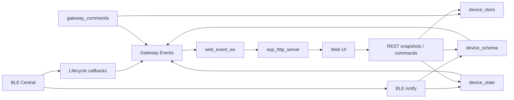

# ESP32 BLE Gateway - WebSocket Realtime Sync Implementation Plan

**Version:** 2.2  
**Date:** 2026-09-01  
**Target:** ESP32-S3 / ESP-IDF 6.1.x / 16 MB Flash / 8 MB PSRAM  
**Scope:** Browser realtime synchronization for Device, Schema and Feature State

> Tài liệu này là implementation plan. Mỗi phase chỉ hoàn thành khi toàn bộ checklist và test gate của phase được đánh dấu `[x]` bằng fresh evidence.

## Nguyên tắc chung

- REST giữ vai trò **authoritative snapshot + recovery**.
- WebSocket chỉ truyền **delta / invalidation / recovery signal**.
- BLE Central là source of truth cho connection runtime.
- `device_schema` là source of truth cho schema snapshot/revision.
- `device_state` là source of truth cho feature runtime state.
- Event producer không phụ thuộc `web_server`.
- Không `malloc`, không cJSON, không WebSocket send trong BLE/domain callback path.
- Không tạo per-client FreeRTOS task.
- Queue/ring/client count/payload đều bounded.
- Production target mặc định tối đa **2 browser WebSocket clients**.
- Mọi phase phải có unit/integration/hardware test phù hợp, không chỉ build-pass.

## Roadmap

| Phase | Nội dung | Dependency | Gate chính |
|---|---|---|---|
| WS-P00 | Architecture + concurrency hardening | - | State access an toàn, source-of-truth rõ |
| WS-P01 | Event bus + producers | P00 | Event đúng nguồn, bounded, sequence đúng |
| WS-P02 | `/ws/events` transport | P01 | 2 clients ổn định, HTTPD-safe send |
| WS-P03 | Snapshot/delta consistency | P02 | Race/gap/reconnect hội tụ đúng |
| WS-P04 | Frontend realtime | P03 | Bỏ polling/fixed-delay cũ |
| WS-P05 | Resource + security | P04 | RAM/socket/security gates pass |
| WS-P06 | Qualification | P00-P05 | Full automated + hardware + soak pass |
| WS-P07 | Rollout + DoD | P06 | Docs/config/rollback/release complete |

```text
P00 -> P01 -> P02 -> P03 -> P04 -> P05 -> P06 -> P07
```

## Event contract tối thiểu

```text
device.connection
    device_id
    state / online
    seq

device.schema
    device_id
    revision
    state
    seq

feature.state
    device_id
    feature_id
    property_id
    value type/value
    updated_at_ms
    seq

resync.required
    seq / reason
```

Không gửi full device list hoặc full schema trong mỗi event.


---

## WS-P00 - Kiến trúc và hardening nền tảng

**Mục tiêu:** Chốt source-of-truth, protocol/event semantics và xử lý P0 concurrency trước khi mở realtime transport.

**Dependencies:** Không

**Files/modules chính:** `device_state`, `device_schema`, `ble_central`, `device_store`, `device_template`, Web UI hiện tại

### Checklist triển khai

- [x] Xác nhận BLE Central là source of truth cho connection runtime; Device Store chỉ giữ persistent identity/metadata.
- [x] Xác nhận protocol v4 strict và không đưa device-level `type` trở lại event contract.
- [x] Xác nhận `device_schema` là source của schema snapshot/revision và `device_state` là source của feature runtime state.
- [x] Thay zero-copy retained view của `device_state` bằng copy-out snapshot hoặc cơ chế lock/lifetime tương đương.
- [x] Không giữ pointer vào `device_state` qua mutation hoặc qua context khác.
- [x] Giữ provisioning mode tách biệt; realtime event server chỉ thuộc gateway mode.
- [x] Lập danh sách polling/fixed-delay hiện tại cần loại bỏ sau khi realtime path pass.

### Test plan của phase

| ID | Loại | Kịch bản | Kết quả PASS |
|---|---|---|---|
| `P00-T01` | Unit | Ghi BOOL state rồi đọc snapshot. | Đúng `device_id`, `feature_id`, `property_id`, value, `valid=true`; không trả pointer nội bộ nếu chọn copy-out API. |
| `P00-T02` | Unit | Ghi INT state ở min/0/max và đọc lại. | Không truncate/sai sign; timestamp hợp lệ. |
| `P00-T03` | Concurrency | Một task cập nhật state liên tục, task khác đọc snapshot trong nhiều vòng. | Không torn entry, crash, use-after-mutation hoặc dữ liệu ngoài phạm vi snapshot. |
| `P00-T04` | Concurrency | Xen kẽ `get_all()`, update và `forget(device)` cho 2 device. | Snapshot nhất quán; `forget(A)` không xóa B. |
| `P00-T05` | Capacity | Lấp đủ `DEVICE_STATE_MAX_ENTRIES`, sau đó thêm key mới và update key cũ. | Key mới fail/drop theo contract; update key cũ vẫn hoạt động; count không vượt giới hạn. |
| `P00-T06` | Lifecycle | READY -> feature state -> disconnect. | State được clear/invalidate đúng lúc disconnect; schema/connection source-of-truth không bị trộn. |
| `P00-T07` | Regression | Chạy test hiện hữu của `device_schema`, `device_state`, dispatcher và BLE Central. | Không phát sinh regression do thay API/lifetime của state snapshot. |
| `P00-T08` | Build | Build firmware production và test app với `MINIMAL_BUILD`. | Không thiếu `REQUIRES`, không warning/error mới liên quan API được harden. |

**Exit Criteria WS-P00**

- [x] `P00-T01..T08` PASS.
- [x] Không còn API Web/consumer nào giữ zero-copy state pointer qua mutation boundary.
- [x] Không còn race đã biết giữa BLE state update và HTTPD/schema read.
- [x] Baseline memory, task stack và test result được ghi lại để so sánh ở phase sau.

### Nội dung kỹ thuật

### 1. Mục tiêu tài liệu

Tài liệu này định nghĩa kiến trúc và kế hoạch tích hợp WebSocket server vào ESP32 BLE Gateway để Web UI nhận thay đổi trạng thái theo event thay vì phụ thuộc vào polling.

Tài liệu được viết lại sau khi review source code hiện tại của repository. Đây không phải bản chuyển đổi định dạng từ tài liệu WebSocket v1.1 cũ. Kiến trúc đã được cập nhật theo các thay đổi lớn trong code:

- protocol BLE đã chuyển sang **v4 strict**;
- `device_capabilities` đã được thay bằng `device_schema`;
- có thêm `device_state` cho runtime semantic state;
- có thêm `device_template` cho semantic UI;
- device-level `type` đã bị loại bỏ;
- Web UI đã dùng `/api/devices/schema`;
- MCP đã chuyển sang semantic dynamic tools;
- static MCP `device_command` và `list_device_capabilities` đã bị loại bỏ;
- hai slot schema listener hiện tại của `device_schema` đã có consumer;
- UI vẫn còn một số polling/fixed-delay có thể thay bằng event.

Mục tiêu cuối cùng:

```text
BLE / domain state change
        |
        v
gateway_events
        |
        v
web_event_ws
        |
        v
/ws/events
        |
        v
Web UI state
```

REST tiếp tục là nguồn snapshot và command API. WebSocket chỉ làm kênh **realtime delta/invalidation**.

---

---

### 2. Quyết định kiến trúc

#### 2.1 Chọn WebSocket

Với gateway hiện tại, phương án khuyến nghị là:

```text
REST:
- initial snapshot
- CRUD
- command
- schema fetch
- schema refresh
- recovery/resync

WebSocket:
- device lifecycle
- device CRUD invalidation
- schema activated
- feature runtime state
- resync notification
```

Endpoint đề xuất:

```text
GET /ws/events
```

Trong LAN, khi Web UI được phục vụ trực tiếp từ gateway:

```text
http://<gateway>/
ws://<gateway>/ws/events
```

Không cần HTTPS/WSS cho mô hình LAN HTTP hiện tại. Không expose endpoint này trực tiếp ra Internet.

#### 2.2 Không tạo WebSocket server riêng

Không tạo thêm HTTP/WebSocket task độc lập.

Dùng chính `esp_http_server` đang chạy:

```text
                    esp_http_server
                           |
          +----------------+----------------+
          |                |                |
       Web assets       REST API          /mcp
          |
          +-------------------------------+
                                          |
                                      /ws/events
```

`WEB_GATEWAY_STACK_SIZE` hiện là `12288`. Giữ nguyên trong lần tích hợp đầu tiên và đo stack high-watermark trước khi thay đổi.

#### 2.3 Không dùng `mcp_ws_bridge`

`components/mcp_ws_bridge` là **outgoing WebSocket client** dùng để nối gateway ra MCP/Xiaozhi broker.

Nó không phải browser WebSocket server.

Không dùng lại state machine hoặc client transport của `mcp_ws_bridge` cho `/ws/events`.

---

---

### 3. Source code hiện tại cần bám theo

#### 3.1 Protocol v4 strict

`components/cbor_codec/include/cbor_codec.h` hiện định nghĩa:

```c
#define GW_MSG_DEVICE_ID_LEN    32
#define GW_FEATURE_ID_LEN       32
#define GW_PROTOCOL_VERSION      4
```

Message v4 có semantic fields:

```text
feature_id
feature_type
feature_schema_version
property_id
feature_value_bool
feature_value_int
```

Realtime WebSocket vì vậy phải hỗ trợ ít nhất `device.connection`, `device.schema` và `feature.state`; chỉ online/offline là không đủ.

#### 3.2 Device Store v3

`device_store` hiện có giới hạn:

```text
max devices     = 16
device id       = 32 bytes
device name     = 32 bytes
schema version  = 3
```

Device-level `type` đã bị loại bỏ và không được đưa trở lại event contract.

#### 3.3 Device Schema

`device_schema` hỗ trợ tối đa:

```text
12 tools/device
12 features/device
```

Snapshot chứa:

```text
device_id
state
revision
snapshot_id
tools[]
features[]
```

Schema state:

```text
unknown
discovering
ready
unsupported
error
```

Hai listener slot hiện hữu đã có consumer. Realtime WebSocket không được phụ thuộc vào việc có thêm listener slot mới; event phải được phát tại authoritative state transition hoặc qua một fan-out layer độc lập.

#### 3.4 Device State

`device_state` lưu runtime feature state:

```text
(device_id, feature_id, property_id)
    -> bool/int value
    -> valid
    -> updated_at_ms
```

Giới hạn:

```c
#define DEVICE_STATE_MAX_ENTRIES 96
```

BLE notification:

```text
type    = device_event
command = feature_state
```

được consume bởi `device_state_on_notify()` và không đi tiếp tới dispatcher. Đây là source chính cho event `feature.state`.

#### 3.5 Semantic template

`device_template` map:

```text
(feature_type, feature_schema_version)
        ->
semantic_name
primary_property
```

Web UI hiện render semantic feature card thay vì device category cũ.

### 4. Hiện trạng Web UI và các điểm còn polling

#### 4.1 Device connection

`components/web_server/www_src/dashboard/js/features/devices.js` vẫn có:

```js
refreshConnectionUntilOnline(deviceId)
```

Flow hiện tại:

```text
add device
    |
    v
REST returns
    |
    v
poll GET /api/devices mỗi 1 giây
    |
    +-- tối đa 12 lần
```

Đây chính là phần WebSocket nên loại bỏ.

#### 4.2 Schema refresh

Flow hiện tại:

```js
await api.refreshDeviceSchema(device.id);
await new Promise(resolve => setTimeout(resolve, 2500));
await this.loadSchema(device, true);
```

Fixed delay `2500 ms` không phản ánh thời gian discovery thật.

Sau khi có realtime event:

```text
POST /api/devices/schema/refresh
        |
        v
202 Accepted
        |
        v
device_schema worker
        |
        v
schema activation
        |
        v
device.schema event
        |
        v
UI fetches fresh schema immediately
```

Không cần sleep 2.5 giây.

#### 4.3 Feature state

Hiện `/api/devices/schema` enrich feature với state lấy từ `device_state`.

Nếu một peripheral gửi spontaneous `feature_state`, browser không nhận ngay trừ khi có thao tác làm reload schema.

WebSocket nên truyền **delta state**, không reload toàn bộ schema cho mỗi notification.

---

---

### 5. Source of truth

Mỗi loại state phải có đúng một owner.

| State | Source of truth | WebSocket role |
|---|---|---|
| Device registry/name | `device_store` | invalidate/update UI |
| BLE connection | `ble_central` | push lifecycle |
| Schema | `device_schema` | notify change-set/invalidation |
| Runtime feature state | `device_state` | push value delta |
| Semantic mapping | `device_template` | đọc qua schema REST |
| MCP exposure/catalog | `mcp_tool_exposure` | optional later |
| Gateway health | `gateway_status` | optional later |
| Xiaozhi bridge | `mcp_ws_bridge` | optional later |

WebSocket không được trở thành source of truth.

---

---

### 6. Kiến trúc mới đề xuất



Nếu Markdown renderer không hỗ trợ Mermaid, flow tương đương:

```text
BLE lifecycle -----------+
                         |
device_schema change-set ----+--> gateway_events --> web_event_ws --> /ws/events
                         |
device_state update -----+
                         |
gateway CRUD ------------+

Web UI <-- REST snapshot ------------------------------- gateway
Web UI <-- WebSocket delta ----------------------------- gateway
```

---

---

### 19. P0 hardening: `device_state` concurrency

Source review hiện tại cho thấy:

```c
static device_state_entry_t s_entries[DEVICE_STATE_MAX_ENTRIES];
static size_t s_count;
```

`device_state_on_notify()` mutate table.

Trong khi:

```text
web_device_schema_api
    -> device_state_get_all()
```

đọc zero-copy view trỏ trực tiếp vào internal storage.

source hiện tạier hiện ghi:

```text
valid until next mutation
```

Nhưng source review không thấy synchronization rõ ràng quanh `s_entries/s_count`.

Với WebSocket, số consumer realtime tăng lên nên cần harden trước production.

#### 19.1 Khuyến nghị

Thêm mutex cho `device_state` và chuyển Web/API sang copy-out:

```c
typedef struct {
    device_state_entry_t entries[DEVICE_SCHEMA_MAX_FEATURES];
    size_t count;
} device_state_snapshot_t;

esp_err_t device_state_snapshot(
    const char *device_id,
    device_state_snapshot_t *out);
```

Hoặc API copy-out theo caller buffer:

```c
esp_err_t device_state_snapshot(
    const char *device_id,
    device_state_entry_t *entries,
    size_t capacity,
    size_t *out_count);
```

#### 19.2 Không giữ lock khi publish

Flow:

```text
lock state
update entry
copy value to local event
unlock state
publish event
```

Không:

```text
lock state
publish
listener -> web
...
unlock
```

---

---

### 52. Documentation discrepancies phát hiện trong repo

Source code mới hơn một số README.

#### Root `README.md`

Một số nội dung vẫn stale:

- ghi protocol v3;
- nói gateway vẫn nhận v1/v2;
- liệt kê `/api/capabilities`;
- còn legacy MCP `device_command`.

Current code là protocol v4 strict và schema API.

#### `components/web_server/README.md`

Một số nội dung vẫn stale:

- nhắc `web_capability_api`;
- nhắc `/api/capabilities*`;
- ghi route slot khác với `web_server.c`.

#### Nguyên tắc cho implementation này

Ưu tiên:

```text
source hiện tại source code
AGENTS.md
current protocol/schema source hiện tạiers
```

trước README cũ.

Nên cleanup README trong PR riêng hoặc cùng PR WebSocket nếu scope cho phép.

---

---


---

## WS-P01 - `gateway_events` và domain event producers

**Mục tiêu:** Tạo event bus bounded, allocation-free ở publish path và phát event đúng tại authoritative state transitions.

**Dependencies:** WS-P00

**Files/modules chính:** `components/gateway_events`, BLE lifecycle, `device_schema`, `device_state`, dispatcher/device CRUD

### Checklist triển khai

- [x] Tạo `gateway_events` độc lập với `web_server`.
- [x] Event struct dùng fixed-size fields; không giữ pointer ephemeral.
- [x] Global sequence monotonic, zero reserved nếu cần.
- [x] Publish path không `malloc`, không cJSON, không WebSocket send.
- [x] Phát `device.connection` khi lifecycle state thật thay đổi.
- [x] Phát `device.schema` sau khi active schema đã hợp lệ/persisted.
- [x] Phát `feature.state` sau khi `device_state` cache đã cập nhật.
- [x] Phát CRUD invalidation từ domain/dispatcher path để REST và MCP hội tụ cùng event behavior.
- [x] Không phát duplicate event cho cùng một state transition.

### Test plan của phase

| ID | Loại | Kịch bản | Kết quả PASS |
|---|---|---|---|
| `P01-T01` | Unit | Init event bus, register listener hợp lệ. | Listener nhận event; API trả status đúng. |
| `P01-T02` | Unit | Đăng ký vượt listener capacity / duplicate registration. | Fail deterministic; không ghi đè listener đang dùng. |
| `P01-T03` | Unit | Publish event với buffer local rồi producer sửa/ra khỏi scope. | Consumer nhận bản copy nguyên vẹn; không giữ pointer ephemeral. |
| `P01-T04` | Unit | Publish N event liên tiếp. | `seq` tăng monotonic; zero/wrap behavior đúng contract. |
| `P01-T05` | Concurrency | Nhiều FreeRTOS task publish đồng thời. | Không duplicate/corrupt sequence; mỗi event có payload nguyên vẹn. |
| `P01-T06` | Fanout | Có nhiều listener đang active. | Mỗi listener nhận đúng event theo ordering contract; một listener lỗi không phá listener khác. |
| `P01-T07` | BLE integration | Device READY -> disconnect -> reconnect. | Event lần lượt phản ánh online/offline/online đúng authoritative BLE state; không duplicate transition. |
| `P01-T08` | Schema integration | Discovery/refresh success, unchanged, error. | Chỉ success/active schema transition phát event phù hợp; không phát schema-ready giả ở error. |
| `P01-T09` | State integration | Nhận `feature_state` BOOL và INT. | Cache update hoàn tất trước khi `feature.state` được publish. |
| `P01-T10` | CRUD integration | Add/edit/delete qua REST và qua domain path khác được hỗ trợ. | Cùng một domain transition tạo cùng event contract, không phụ thuộc HTTP transport. |
| `P01-T11` | Fault | Listener queue/consumer tạm không xử lý được event. | Event bus không block BLE/domain producer; failure metric/return path đúng thiết kế. |
| `P01-T12` | Memory | Burst publish ở mức test cao hơn production. | Không heap growth/leak; publish path không malloc/cJSON. |

**Exit Criteria WS-P01**

- [x] `P01-T01..T12` PASS.
- [x] Event ordering, sequence và ownership contract được unit-test hóa.
- [x] BLE/schema/state/CRUD producers đều có integration test.
- [x] Producer path không block và không cấp phát heap động.

### Nội dung kỹ thuật

### 7. Component mới: `gateway_events`

#### 7.1 Vì sao cần component này

Không gọi WebSocket trực tiếp từ:

- NimBLE callback;
- `device_schema`;
- `device_state`;
- command dispatcher.

Nếu domain code include `web_server`, dependency sẽ đảo chiều:

```text
domain -> web
```

Đây là coupling không mong muốn.

Thay vào đó:

```text
domain -> gateway_events <- web
```

#### 7.2 Lưu ý quan trọng về `device_schema` listener

Hiện `device_schema` chỉ có hai listener API:

```c
existing device_schema listener slot 1(...)
existing device_schema listener slot 2(...)
```

Hai slot này đã được dùng:

```text
listener #1 -> mcp_tool_exposure
listener #2 -> device_state
```

Vì vậy **không được** tích hợp WebSocket bằng cách chiếm listener thứ ba hoặc tái sử dụng `listener2`.

WebSocket guide v2.0 chọn generic domain event bus để tránh phụ thuộc vào số slot listener này.

#### 7.3 Cấu trúc component

```text
components/gateway_events/
├── CMakeLists.txt
├── gateway_events.c
├── include/
│   └── gateway_events.h
└── test/
    ├── CMakeLists.txt
    └── test_gateway_events.c
```

#### 7.4 Contract đề xuất

```c
typedef enum {
    GW_EVENT_DEVICE_CHANGED = 0,
    GW_EVENT_DEVICE_CONNECTION,
    GW_EVENT_DEVICE_SCHEMA,
    GW_EVENT_FEATURE_STATE,
    GW_EVENT_RESYNC_REQUIRED,
} gateway_event_type_t;

typedef enum {
    GW_EVENT_VALUE_NONE = 0,
    GW_EVENT_VALUE_BOOL,
    GW_EVENT_VALUE_INT,
} gateway_event_value_kind_t;

typedef struct {
    uint32_t seq;
    gateway_event_type_t type;

    char device_id[GW_MSG_DEVICE_ID_LEN];
    char feature_id[GW_FEATURE_ID_LEN];

    uint8_t property_id;
    gateway_event_value_kind_t value_kind;

    bool bool_value;
    int32_t int_value;

    uint32_t schema_revision;
    int64_t updated_at_ms;
} gateway_event_t;
```

Không chứa:

```text
device name
full device object
full schema
cJSON pointer
heap-owned string
BLE runtime pointer
device_state internal pointer
```

#### 7.5 API đề xuất

```c
typedef void (*gateway_event_listener_t)(
    const gateway_event_t *event,
    void *context);

esp_err_t gateway_events_init(void);

esp_err_t gateway_events_register(
    gateway_event_listener_t listener,
    void *context);

void gateway_events_publish(gateway_event_t *event);

uint32_t gateway_events_current_seq(void);
```

#### 7.6 Yêu cầu bắt buộc

`gateway_events_publish()` phải:

- không `malloc`;
- không serialize JSON;
- không block chờ HTTP;
- không gọi BLE;
- không giữ mutex khi gọi listener;
- cấp `seq` monotonic;
- copy event value trước khi return.

Observer registry nên là fixed array, ví dụ:

```c
#define GATEWAY_EVENT_MAX_LISTENERS 4
```

4 slot là đủ cho WebSocket và các consumer tương lai mà không tạo cấu trúc động.

---

---

### 8. Sequence number

#### 8.1 Mục đích

`seq` dùng để:

- xác định thứ tự event;
- phát hiện event gap;
- đồng bộ REST snapshot với WebSocket delta;
- yêu cầu resync khi queue overflow.

#### 8.2 Không dùng schema revision thay thế

Hai giá trị khác nhau:

```text
device_schema.revision
    = revision của schema của một device

gateway_event.seq
    = global ordering cursor của realtime stream
```

Không trộn hai khái niệm.

#### 8.3 Kiểu dữ liệu

Khuyến nghị:

```c
uint32_t
```

Gateway reboot reset sequence là hợp lệ vì browser cũng reconnect/resync.

Nếu sequence wrap, client thực hiện full resync.

---

---

### 18. Nơi phát event trong code hiện tại

#### 18.1 BLE ready/disconnect - `main/main.c`

Current:

```c
static void on_device_ready(const char *device_id)
{
    if (device_schema_on_ready(device_id) != ESP_OK) {
        ...
    }
}

static void on_device_disconnect(const char *device_id)
{
    device_schema_on_disconnect(device_id);
    device_state_forget(device_id);
}
```

Đề xuất:

```c
static void on_device_ready(const char *device_id)
{
    gateway_events_publish_connection(device_id, true, true);

    if (device_schema_on_ready(device_id) != ESP_OK) {
        ...
    }
}

static void on_device_disconnect(const char *device_id)
{
    gateway_events_publish_connection(device_id, false, false);

    device_schema_on_disconnect(device_id);
    device_state_forget(device_id);
}
```

Không gọi WebSocket API ở đây.

#### 18.2 CRUD - `gateway_commands.c`

Event phải phát từ domain command layer, không phát từ `web_device_api.c`.

Lý do:

```text
REST
MCP
future transport
```

đều có thể gọi cùng domain command.

Ví dụ:

```text
cmd_add_device successful persistence
    -> GW_EVENT_DEVICE_CHANGED

cmd_edit_device successful edit
    -> GW_EVENT_DEVICE_CHANGED

cmd_delete_device completed
    -> GW_EVENT_DEVICE_CHANGED
```

#### 18.3 schema activation - `device_schema.c`

Sau authoritative change-set:

```text
persist/change-set
    -> existing MCP listener
    -> existing device_state listener
    -> gateway_events_publish(schema)
```

Không dùng listener slot thứ ba.

#### 18.4 Feature state - `device_state.c`

Sau khi copy giá trị vào cache:

```text
device_state entry updated
    -> gateway_events_publish(feature_state)
```

Event phải chứa **copy primitive value**, không chứa pointer đến `s_entries`.

---

---

### 31. Device CRUD invalidation

Với:

```json
{
  "type": "device.changed",
  "deviceId": "..."
}
```

Frontend:

```text
debounce 50-100 ms
GET /api/devices
replace state
render
```

CRUD event có tần suất rất thấp nên invalidation + REST reload đơn giản và an toàn hơn gửi arbitrary `name`.

---

---


---

## WS-P02 - WebSocket transport `/ws/events`

**Mục tiêu:** Thêm browser WebSocket server vào `esp_http_server` hiện có với client/ring/socket budget cố định và HTTPD-safe send path.

**Dependencies:** WS-P01

**Files/modules chính:** `web_event_ws.c`, `web_modules.h`, `web_server.c`, `web_gateway_api.c`, `CMakeLists.txt`, `sdkconfig.defaults`

### Checklist triển khai

- [x] Bật `CONFIG_HTTPD_WS_SUPPORT=y` cho target production phù hợp.
- [x] Đăng ký đúng một route `GET /ws/events` ở gateway mode.
- [x] Không tạo HTTP server thứ hai và không reuse outgoing `mcp_ws_bridge`.
- [x] Giữ client limit mặc định 2; không tăng socket count trước measurement.
- [x] Dùng fixed ring/queue; overflow chuyển sang recovery signal thay vì silent loss.
- [x] Dùng `httpd_queue_work()` hoặc HTTPD-safe equivalent; không send từ BLE/domain callback.
- [x] Không tạo per-client FreeRTOS task.
- [x] Receive path giới hạn frame size và chỉ hỗ trợ message type thật sự cần thiết.
- [x] Client close/send error phải prune fd và giải phóng slot.
- [x] Không tăng URI handler budget nếu route mới vẫn nằm trong source hiện tạiroom.

### Test plan của phase

| ID | Loại | Kịch bản | Kết quả PASS |
|---|---|---|---|
| `P02-T01` | HTTPD integration | Kết nối WebSocket hợp lệ tới `/ws/events`. | Handshake thành công, session được nhận dạng là WS client. |
| `P02-T02` | Boot-mode | Thử `/ws/events` trong provisioning mode. | Route không được đăng ký; provisioning behavior cũ không đổi. |
| `P02-T03` | Client limit | Mở client 1, 2, rồi 3. | 1-2 hoạt động; client 3 bị từ chối/đóng theo policy, không ảnh hưởng 1-2. |
| `P02-T04` | Broadcast | Publish một event domain với 2 browser clients. | Cả hai nhận đúng một frame/event; payload/seq giống nhau. |
| `P02-T05` | Frame validation | Gửi text frame hợp lệ nhỏ, binary frame, frame quá giới hạn, malformed input. | Chỉ loại được hỗ trợ được xử lý; frame không hợp lệ bị reject/close an toàn. |
| `P02-T06` | Close churn | Connect/close lặp lại nhiều vòng. | Không leak fd, client slot, heap hoặc work item. |
| `P02-T07` | Broken client | Một client mất TCP đột ngột trong khi broadcast. | Client lỗi được prune; client còn lại tiếp tục nhận event. |
| `P02-T08` | Queue work fault | Fault-inject `httpd_queue_work()` failure. | `work_pending` không kẹt; event mới có thể schedule lại. |
| `P02-T09` | Ring overflow | Làm consumer chậm và publish vượt ring capacity. | Overflow metric tăng và recovery signal được tạo; không overwrite silent. |
| `P02-T10` | REST coexistence | Giữ 2 WS clients rồi chạy GET/POST REST song song. | REST không starvation; latency trong gate; WS vẫn sống. |
| `P02-T11` | MCP coexistence | Giữ 2 WS clients rồi chạy `tools/list`/`tools/call`. | MCP không lỗi do socket/task starvation. |
| `P02-T12` | Stress | Event burst + client churn + REST song song. | HTTPD task không watchdog/reset; heap/socket trở về baseline sau test. |

**Exit Criteria WS-P02**

- [x] `P02-T01..T12` PASS.
- [x] `/ws/events` chỉ tồn tại ở gateway mode.
- [x] Client limit, frame limit, overflow và send-failure đều có test tự động hoặc reproducible test script.
- [x] Không tạo HTTP server/task riêng cho từng WS client.

### Nội dung kỹ thuật

### 9. Component WebSocket server

#### 9.1 File mới

```text
components/web_server/web_event_ws.c
```

Không tạo component server riêng.

#### 9.2 Endpoint

```c
static const httpd_uri_t ws_uri = {
    .uri = "/ws/events",
    .method = HTTP_GET,
    .handler = web_event_ws_handler,
    .is_websocket = true,
};
```

Với ESP-IDF 6.1, nếu cần logic lúc connection vừa handshake thành công, dùng `ws_post_handshake_cb`.

Từ ESP-IDF 6.0.1, URI data handler không còn được gọi trong handshake.

#### 9.3 Kconfig

Hiện repo:

```ini
CONFIG_HTTPD_WS_SUPPORT=n
CONFIG_WS_TRANSPORT=y
```

Đổi:

```ini
CONFIG_HTTPD_WS_SUPPORT=y
```

Nếu dùng post-handshake client registration:

```ini
CONFIG_HTTPD_WS_POST_HANDSHAKE_CB_SUPPORT=y
```

Nếu dùng Origin/auth check trước upgrade:

```ini
CONFIG_HTTPD_WS_PRE_HANDSHAKE_CB_SUPPORT=y
```

`CONFIG_WS_TRANSPORT=y` vẫn giữ cho external MCP WebSocket client.

#### 9.4 Chỉ gateway mode

Không đăng ký `/ws/events` trong provisioning server.

Provisioning mode hiện cố ý không initialize:

- Device Store;
- Dispatcher;
- BLE Central;
- MCP.

Do đó realtime WebSocket thuộc **gateway mode only**.

---

---

### 10. Client limit và socket budget

`web_server.c` hiện dùng:

```c
httpd_config_t config = HTTPD_DEFAULT_CONFIG();
```

và không override `max_open_sockets`.

ESP-IDF `HTTPD_DEFAULT_CONFIG()` hiện có:

```text
max_open_sockets = 7
```

HTTP server còn reserve 3 socket nội bộ ngoài giá trị này.

Khởi đầu với:

```c
#define WEB_WS_MAX_CLIENTS 2
```

Không tăng `max_open_sockets` trong phase đầu.

Lý do:

```text
7 application sockets
- 2 WebSocket dashboard
= 5 còn lại cho REST/MCP/asset/other HTTP traffic
```

Hai browser tab realtime là đủ cho gateway quản trị.

Nếu client thứ ba kết nối:

- từ chối handshake nếu pre-handshake counting đã an toàn;
- hoặc close client thừa sau handshake.

Không để browser mở vô hạn socket.

---

---

### 11. Route budget

Current source:

```c
#define WEB_GATEWAY_MAX_URI_HANDLERS 34
```

Không tăng lên 36 chỉ vì thêm một endpoint.

Thêm `/ws/events` trước, giữ `34`.

Chỉ tăng nếu build/runtime thực sự gặp:

```text
ESP_ERR_HTTPD_HANDLERS_FULL
```

Cũng cần sửa comment route budget trong `web_server.c` từ terminology capability cũ sang device schema.

---

---

### 12. Event ring trong `web_event_ws`

#### 12.1 Không gửi trực tiếp từ producer task

Không làm:

```text
NimBLE callback
    -> snprintf JSON
    -> httpd_ws_send_frame_async()
```

Thay bằng:

```text
producer task
    -> copy gateway_event_t
    -> fixed ring
    -> httpd_queue_work()
    -> HTTPD context
    -> serialize
    -> WS send
```

ESP-IDF documentation khuyến nghị asynchronous WebSocket send ngoài request context thông qua `httpd_queue_work()`.

#### 12.2 Ring size

Khuyến nghị production baseline:

```c
#define WEB_WS_EVENT_RING_DEPTH 32
```

Event fixed-size khoảng dưới 100 byte sẽ tiêu thụ xấp xỉ vài KiB internal RAM.

Lý do chọn 32:

- một device có tối đa 12 features;
- schema activation có thể kích hoạt state seed;
- một seed có thể tạo burst nhiều `feature_state`;
- global schema serializer giảm concurrency nhưng không loại bỏ BLE lifecycle event khác.

Nếu RAM measurement không đạt gate, có thể A/B:

```text
32 -> 16
```

Nhưng không giảm trước khi đo.

#### 12.3 Queue overflow

Không cố đảm bảo at-least-once delivery trên MCU.

Nếu ring đầy:

```text
drop event
set resync_required = true
```

HTTPD worker gửi control event:

```json
{
  "type": "resync.required",
  "seq": 1042
}
```

Client thực hiện REST snapshot lại.

Đây là failure mode an toàn hơn việc tăng queue vô hạn.

---

---

### 15. `httpd_queue_work()` và thread safety

ESP HTTP server API không thread-safe nói chung.

Producer callbacks có thể đến từ:

- NimBLE host context;
- `device_schema` worker;
- command executor worker;
- other application task.

Do đó:

```text
producer context
    |
    | only ring write + schedule
    v
HTTPD context
    |
    | httpd_ws_send_frame_async
    v
socket
```

#### 15.1 `work_pending`

Cần bảo vệ:

```text
event ring
read/write index
work_pending
resync_required
```

bằng cùng một synchronization primitive.

Không dùng một volatile boolean đơn lẻ.

#### 15.2 Không block NimBLE

Không bật một cơ chế khiến `gateway_events_publish()` chờ HTTPD control socket lâu.

Nếu `httpd_queue_work()` fail:

```text
mark resync_required
release producer immediately
```

Worker retry/recovery phải được thiết kế không giữ BLE callback.

---

---

### 16. Client registry

Có hai cách.

#### Option A - explicit registration

Enable:

```ini
CONFIG_HTTPD_WS_POST_HANDSHAKE_CB_SUPPORT=y
```

Post-handshake callback:

```text
fd = httpd_req_to_sockfd(req)
register fd if slot available
```

Trước mỗi send:

```c
httpd_ws_get_fd_info(server, fd)
```

Nếu không còn `HTTPD_WS_CLIENT_WEBSOCKET`, remove slot.

#### Option B - enumerate active clients

Trong HTTPD worker:

```text
httpd_get_client_list()
httpd_ws_get_fd_info()
```

Không cần explicit registry nhưng mỗi broadcast phải enumerate socket.

#### Khuyến nghị

Dùng **Option A** vì:

- max 2 client;
- fixed array rất nhỏ;
- send path đơn giản;
- dễ enforce client cap;
- phù hợp IDF 6.1 post-handshake model.

---

---

### 17. Không thêm heartbeat application trong phase đầu

Current `web_server.c` đã bật TCP keepalive:

```text
keep_alive_idle     = 5
keep_alive_interval = 5
keep_alive_count    = 3
```

ESP HTTP server mặc định cũng tự xử lý WebSocket control PING/PONG/CLOSE khi:

```c
handle_ws_control_frames = false
```

Do đó phase đầu:

```text
no custom WS heartbeat
```

Chỉ thêm app-level heartbeat nếu hardware soak test chứng minh NAT/browser/network tạo stale socket không được phát hiện đủ nhanh.

---

---

### 32. `web_event_ws.c` skeleton

Đây là skeleton kiến trúc, không phải patch đã compile.

```c
#define WEB_WS_MAX_CLIENTS      2
#define WEB_WS_EVENT_RING_DEPTH 32
#define WEB_WS_JSON_MAX         512

typedef struct {
    gateway_event_t events[WEB_WS_EVENT_RING_DEPTH];
    size_t read_index;
    size_t write_index;
    size_t count;

    bool work_pending;
    bool resync_required;

    int clients[WEB_WS_MAX_CLIENTS];

    portMUX_TYPE lock;
    httpd_handle_t server;
} web_event_ws_state_t;
```

Listener:

```c
static void on_gateway_event(
    const gateway_event_t *event,
    void *context)
{
    web_event_ws_state_t *state = context;
    bool schedule = false;

    portENTER_CRITICAL(&state->lock);

    if (state->count == WEB_WS_EVENT_RING_DEPTH) {
        state->resync_required = true;
    } else {
        state->events[state->write_index] = *event;
        state->write_index =
            (state->write_index + 1) %
            WEB_WS_EVENT_RING_DEPTH;
        state->count++;
    }

    if (!state->work_pending) {
        state->work_pending = true;
        schedule = true;
    }

    portEXIT_CRITICAL(&state->lock);

    if (schedule) {
        if (httpd_queue_work(
                state->server,
                web_event_ws_drain,
                state) != ESP_OK) {
            portENTER_CRITICAL(&state->lock);
            state->work_pending = false;
            state->resync_required = true;
            portEXIT_CRITICAL(&state->lock);
        }
    }
}
```

Production implementation phải xử lý trường hợp queue-work fail mà ring vẫn còn data, không để event bị kẹt vô thời hạn. Có thể retry bounded từ non-BLE context hoặc đảm bảo post-handshake/new event kích hoạt drain và gửi `resync.required`.

---

---

### 33. Send path

HTTPD worker:

```text
while ring has event
    pop copied event
    serialize into bounded local buffer

    for each registered fd
        verify HTTPD_WS_CLIENT_WEBSOCKET
        send async frame
        if fail -> prune/mark resync
```

Không giữ ring lock trong lúc:

```text
snprintf
httpd_ws_send_frame_async
```

Lock chỉ bảo vệ queue metadata và copy event.

---

---

### 34. Incoming WebSocket messages

Phase đầu là server-push.

Browser không cần gửi command qua WS.

REST vẫn xử lý command.

Handler có thể:

- accept small text control message như `resync`;
- hoặc chỉ consume/ignore text frame;
- reject oversized payload.

Đề xuất:

```c
#define WEB_WS_RX_MAX 128
```

Không cho browser upload arbitrary JSON lớn qua persistent socket.

---

---

### 44. CMake changes

`components/web_server/CMakeLists.txt`:

```cmake
idf_component_register(
    SRCS
         ...
         "web_event_ws.c"
    ...
    REQUIRES
         ...
         gateway_events
)
```

`main/CMakeLists.txt` cũng cần `gateway_events` nếu `main.c` gọi publish API.

Không dựa vào việc component tồn tại trong thư mục; `MINIMAL_BUILD ON` chỉ link component reachable qua dependency graph.

---

---


---

## WS-P03 - Snapshot + delta consistency và recovery

**Mục tiêu:** Đảm bảo UI hội tụ đúng trạng thái dù event đến trước/trong/sau snapshot, bị drop, browser reconnect hoặc sequence có gap.

**Dependencies:** WS-P02

**Files/modules chính:** REST snapshot handlers, WebSocket event envelope, API wrapper

### Checklist triển khai

- [x] REST snapshot trả event cursor qua `X-Gateway-Event-Seq` hoặc contract tương đương.
- [x] Cursor được lấy cùng logic sequence dùng cho WebSocket event stream.
- [x] Frontend buffer delta trong khi snapshot đang fetch.
- [x] Bỏ event `seq <= base_seq`, replay event mới hơn theo thứ tự.
- [x] Phát hiện sequence gap và chuyển sang full REST resync.
- [x] Ring overflow/client lag tạo `resync.required` hoặc cơ chế tương đương.
- [x] Reconnect luôn đi qua deterministic snapshot/resync, không đoán local state.
- [x] Schema revision và global event sequence là hai contract riêng.

### Test plan của phase

| ID | Loại | Kịch bản | Kết quả PASS |
|---|---|---|---|
| `P03-T01` | Snapshot race | Event xảy ra ngay trước khi snapshot lấy cursor. | Event đã nằm trong snapshot hoặc được loại đúng bằng `base_seq`; không apply hai lần. |
| `P03-T02` | Snapshot race | Event xảy ra sau cursor nhưng trong lúc REST body đang build/send. | Event được buffer và replay sau snapshot. |
| `P03-T03` | Snapshot race | Event xảy ra ngay sau REST hoàn tất nhưng trước khi client chuyển live. | Event không mất; replay/live transition giữ ordering. |
| `P03-T04` | Gap recovery | Drop cố ý một `seq`. | Client phát hiện gap, dừng delta apply và full-resync. |
| `P03-T05` | Duplicate | Inject lại cùng `seq`. | Không apply state mutation lần hai. |
| `P03-T06` | Out-of-order | Gửi `N+1` trước `N`. | Client không làm state lùi/sai; kích hoạt recovery theo contract. |
| `P03-T07` | Overflow recovery | Server ring overflow rồi gửi `resync.required`. | Client snapshot lại và trở về live stream đúng sequence. |
| `P03-T08` | Reconnect | Ngắt network trong event burst rồi reconnect. | Sau reconnect, UI khớp authoritative REST snapshot và tiếp tục nhận delta. |
| `P03-T09` | Multi-resource | Device list, schema revision và feature state cùng thay đổi gần nhau. | Global event seq không bị nhầm với schema revision; cuối cùng cả ba view hội tụ. |
| `P03-T10` | Wrap | Đưa sequence gần `UINT32_MAX` bằng test hook. | Compare/wrap strategy hoạt động đúng hoặc chủ động force-resync theo contract. |
| `P03-T11` | Cursor API | REST snapshot có/không có cursor header trong các error path. | Success response luôn có cursor cần thiết; error không tạo baseline giả. |
| `P03-T12` | Fault | Snapshot REST fail/timeout trong lúc WS vẫn nhận event. | Client giữ bounded buffer/dirty flag, retry/resync; không tăng buffer vô hạn. |

**Exit Criteria WS-P03**

- [x] `P03-T01..T12` PASS.
- [x] Không tồn tại cửa sổ race đã biết làm mất event giữa REST snapshot và WS live mode.
- [x] Gap, duplicate, out-of-order, overflow và reconnect đều hội tụ về authoritative state.
- [x] Buffer/resync path có bound rõ ràng.

### Nội dung kỹ thuật

### 20. REST snapshot + WebSocket delta

WebSocket không thay REST snapshot.

#### 20.1 Client startup

```text
1. Open /ws/events
2. Buffer incoming event
3. GET /api/devices
4. Read snapshot event sequence
5. Replace frontend device state
6. Replay buffered event newer than baseline
7. Enter live mode
```

#### 20.2 Vì sao cần sequence baseline

Nếu chỉ:

```text
GET snapshot
then
connect WS
```

có race:

```text
snapshot read
   |
state changes here  <-- event lost
   |
WS connected
```

Nếu:

```text
WS connected
then
GET snapshot
```

cũng có thể nhận delta trong lúc snapshot đang tải.

Giải pháp: WebSocket mở trước + buffer + snapshot cursor.

---

---

### 21. `X-Gateway-Event-Seq`

Thêm response source hiện tạier:

```text
X-Gateway-Event-Seq: 1234
```

cho các snapshot cần realtime consistency:

```text
GET /api/devices
GET /api/devices/schema?device_id=...
```

#### 21.1 Capture order

Server nên capture event seq **trước** khi build snapshot:

```c
uint32_t base_seq = gateway_events_current_seq();

/* build authoritative snapshot */

char seq_text[16];
snprintf(seq_text, sizeof(seq_text), "%" PRIu32, base_seq);
httpd_resp_set_hdr(request, "X-Gateway-Event-Seq", seq_text);
```

Nếu state thay đổi sau `base_seq`, event của nó có sequence lớn hơn baseline và sẽ được replay.

Có thể có duplicate semantic update nếu mutation được snapshot nhìn thấy đồng thời event cũng replay; event handler phải idempotent.

#### 21.2 Schema revision vẫn giữ nguyên

`/api/devices/schema` hiện đã trả:

```json
{
  "revision": 7
}
```

Không thay trường này bằng global event sequence.

---

---

### 22. Web API wrapper

Current `api.request()` chỉ trả parsed JSON và bỏ response source hiện tạier.

Cần bổ sung metadata-aware path.

Ví dụ:

```js
async requestWithMeta(path, options = {}) {
    options.credentials = 'same-origin';

    const response = await fetch(path, options);
    const data = await response.json();

    if (!response.ok || data.success === false) {
        throw new Error(data.message || `HTTP ${response.status}`);
    }

    const rawSeq = response.source hiện tạiers.get('X-Gateway-Event-Seq');
    const eventSeq = rawSeq ? Number(rawSeq) : 0;

    return {data, eventSeq};
}
```

Sau đó:

```js
async getDevicesSnapshot() {
    const {data, eventSeq} =
        await this.requestWithMeta('/api/devices');

    return {
        eventSeq,
        devices: data.map(/* existing mapping */)
    };
}
```

---

---

### 25. Startup/resync logic

Pseudo-code:

```js
async resync() {
    this.live = false;
    this.buffer = [];

    const snapshot = await api.getDevicesSnapshot();

    devices.replaceSnapshot(snapshot.devices);

    this.lastSeq = snapshot.eventSeq;

    const buffered = this.buffer
        .filter(event => event.seq > this.lastSeq)
        .sort((a, b) => a.seq - b.seq);

    for (const event of buffered) {
        this.apply(event);
    }

    this.buffer = [];
    this.live = true;
}
```

Trong implementation thực tế cần tránh race khi đổi từ buffer sang live. Chuyển trạng thái và swap buffer phải synchronous trong JavaScript event loop.

---

---

### 26. Event gap

Khi live:

```js
if (message.seq <= this.lastSeq) {
    return; // duplicate/old
}

if (this.lastSeq !== 0 &&
    message.seq !== this.lastSeq + 1) {
    void this.resync();
    return;
}

this.lastSeq = message.seq;
this.apply(message);
```

Nếu nhận:

```text
resync.required
```

thì full resync ngay.

---

---


---

## WS-P04 - Frontend realtime integration

**Mục tiêu:** Tạo WebSocket singleton cho dashboard, thay polling/fixed-delay bằng event-driven update và giữ REST cho snapshot/recovery.

**Dependencies:** WS-P03

**Files/modules chính:** `core/events.js`, `core/api.js`, `features/devices.js`, `shell.html`, Web UI build pipeline

### Checklist triển khai

- [x] Tạo `core/events.js` singleton; một tab chỉ giữ một connection.
- [x] URL tự chọn `ws:`/`wss:` theo page protocol.
- [x] Reconnect có bounded exponential backoff + jitter.
- [x] Startup thực hiện snapshot + buffered-delta replay.
- [x] Xóa `refreshConnectionUntilOnline()` và polling 1 giây sau add device.
- [x] Connection event cập nhật card và detail view trực tiếp.
- [x] Schema event cho selected device trigger một schema snapshot mới; không push full schema qua WS.
- [x] Xóa sleep 2500 ms trong schema refresh; UI chờ schema event/state transition.
- [x] `feature.state` cập nhật control trực tiếp khi feature đã biết.
- [x] Background device event không phá selected-device route/state.
- [x] Khi WS unavailable, UI báo degraded state và dùng REST resync có kiểm soát.
- [x] Rebuild + gzip + embed dashboard theo pipeline hiện tại.

### Test plan của phase

| ID | Loại | Kịch bản | Kết quả PASS |
|---|---|---|---|
| `P04-T01` | Static | Build Web UI, kiểm tra generated dashboard và JavaScript syntax. | Một `<script>` hợp lệ; `events.js` được include đúng thứ tự; không reference undefined. |
| `P04-T02` | E2E device | Add device khi BLE connect mất vài giây. | Card tự chuyển online qua event; không gọi polling 1 giây. |
| `P04-T03` | E2E lifecycle | Tắt/bật peripheral. | Card + detail chuyển offline/online realtime và đúng selected device. |
| `P04-T04` | E2E schema | Nhấn refresh schema. | API trả accepted; UI chờ event/snapshot, không dùng fixed `2500 ms` sleep. |
| `P04-T05` | E2E feature BOOL | Device notify ON/OFF. | Semantic control đổi đúng state mà không reload full device list. |
| `P04-T06` | E2E feature INT | Device notify nhiều INT value gồm boundary. | UI render đúng value/range/unit theo schema. |
| `P04-T07` | Routing | Selected device A, event của device B đến liên tục. | Route/detail A không bị thay; chỉ state B trong cache/grid được cập nhật phù hợp. |
| `P04-T08` | Reload race | Reload tab trong event burst. | Startup snapshot + replay hội tụ; không double socket/listener. |
| `P04-T09` | Network recovery | Wi-Fi/browser network mất rồi hồi phục. | Backoff bounded; chỉ một reconnect timer/socket; resync trước live. |
| `P04-T10` | Multi-tab | Mở 2 dashboard tabs và thao tác độc lập. | Mỗi tab tối đa một WS; không request storm; cả hai hội tụ. |
| `P04-T11` | Degraded mode | WS endpoint unavailable/tạm disable. | UI báo degraded và dùng bounded REST recovery; không polling 1s vô hạn. |
| `P04-T12` | Regression | Scanner, Settings, MCP Exposure và navigation. | Các feature không liên quan vẫn hoạt động sau khi thêm `events.js`. |

**Exit Criteria WS-P04**

- [x] `P04-T01..T12` PASS.
- [x] `refreshConnectionUntilOnline()` và schema fixed delay không còn trong production path.
- [x] Không có duplicate WebSocket connection/listener sau navigation/reload/reconnect.
- [x] UI có degraded/recovery behavior rõ ràng khi realtime channel mất.

### Nội dung kỹ thuật

### 23. Frontend module mới: `core/events.js`

Đề xuất:

```text
components/web_server/www_src/dashboard/js/core/events.js
```

Không dùng ES module vì dashboard build hiện assemble mọi JS vào một `<script>` duy nhất.

Trong `shell.html`:

```html
<!-- @js core/state.js -->
<!-- @js core/ui.js -->
<!-- @js core/i18n.js -->
<!-- @js core/api.js -->
<!-- @js core/events.js -->
<!-- @js core/nav.js -->
```

`CMakeLists.txt` đã `GLOB_RECURSE` `www_src/*.js`, vì vậy file mới sẽ tự trở thành build dependency, nhưng vẫn phải có `@js` để được assemble vào dashboard.

---

---

### 24. Frontend WebSocket singleton

Skeleton:

```js
const gatewayEvents = {
    socket: null,
    reconnectTimer: null,
    reconnectAttempt: 0,

    live: false,
    lastSeq: 0,
    buffer: [],

    connect() {
        if (this.socket &&
            (this.socket.readyState === WebSocket.OPEN ||
             this.socket.readyState === WebSocket.CONNECTING)) {
            return;
        }

        const protocol =
            location.protocol === 'https:' ? 'wss:' : 'ws:';

        this.socket = new WebSocket(
            `${protocol}//${location.host}/ws/events`
        );

        this.socket.onopen = () => {
            this.reconnectAttempt = 0;
            this.live = false;
            this.buffer = [];
            void this.resync();
        };

        this.socket.onmessage = event => {
            this.onMessage(event.data);
        };

        this.socket.onclose = () => {
            this.live = false;
            this.scheduleReconnect();
        };

        this.socket.onerror = () => {
            this.socket?.close();
        };
    },

    scheduleReconnect() {
        if (this.reconnectTimer) return;

        const base = Math.min(
            10000,
            500 * (2 ** this.reconnectAttempt++)
        );

        const jitter = Math.floor(Math.random() * 250);

        this.reconnectTimer = setTimeout(() => {
            this.reconnectTimer = null;
            this.connect();
        }, base + jitter);
    }
};
```

---

---

### 27. Device connection integration

Thay:

```js
refreshConnectionUntilOnline(deviceId)
```

bằng event:

```js
applyConnectionEvent(message) {
    const device = state.connectedDevices.find(
        item => item.id === message.deviceId
    );

    if (!device) {
        void devices.loadFresh();
        return;
    }

    device.status = message.ready ? 'online' : 'offline';

    devices.renderGrid();

    if (state.selectedDeviceDetail?.id === device.id) {
        state.selectedDeviceDetail = device;
        devices.renderConnectionState(device);

        document
            .getElementById('feature-offline-notice')
            .classList.toggle(
                'hidden',
                device.status === 'online'
            );
    }
}
```

Sau migration:

```text
delete connectionRefreshes
delete refreshConnectionUntilOnline()
```

---

---

### 28. Connection semantics

Current `/api/devices` dùng:

```text
ble_status.connected
```

trong khi lifecycle `on_device_ready` xảy ra sau secure/GATT/notify ready.

Nên định nghĩa rõ:

```text
connected = ACL link exists
ready     = device usable for gateway commands
online UI = ready
```

Phase đầu có thể giữ UI boolean `online/offline` và phát online tại `on_device_ready()`.

P1 nên bổ sung `ready` vào `/api/devices` để REST snapshot và realtime event có cùng semantic.

---

---

### 29. Schema integration

Current UI:

```text
POST refresh
sleep 2500 ms
GET schema
```

Sau WebSocket:

```text
POST refresh
202
return UI to "discovering"

device.schema event
    |
    v
if selected device
    -> loadSchema(device, true)
```

Trong `refreshSchema()`:

```js
await api.refreshDeviceSchema(device.id);
this.renderSchemaState('loading');
```

Không `setTimeout(2500)`.

Success toast chỉ hiện sau event + successful schema fetch.

Nên thêm timeout UX dài hơn, ví dụ 10-15 giây, chỉ để báo "discovery taking longer", không dùng timeout đó làm polling interval.

---

---

### 30. Feature state integration

Không GET toàn schema cho mỗi `feature.state`.

Thay local state:

```js
applyFeatureState(message) {
    if (state.selectedDeviceDetail?.id !== message.deviceId) {
        return;
    }

    const feature = this.currentFeatures.find(
        item =>
            item.feature_id === message.featureId &&
            item.property_id === message.propertyId
    );

    if (!feature) {
        void this.loadSchema(state.selectedDeviceDetail);
        return;
    }

    feature.state = {
        valid: true,
        value_bool:
            message.valueType === 'bool'
                ? Boolean(message.value)
                : false,
        value_int:
            message.valueType === 'int'
                ? Number(message.value)
                : 0
    };

    this.updateFeatureCard(feature);
}
```

Tốt nhất update đúng card/control, không render toàn page.

Nếu UI chưa có targeted renderer, phase đầu có thể re-render `renderFeatures()` vì tối đa 12 features/device; vẫn rẻ hơn REST round trip.

---

---

### 45. Web build integration

Dashboard source:

```text
components/web_server/www_src/
```

Build:

```text
www_src
    -> tools/build_webui.py
    -> dashboard.html
    -> gzip
    -> EMBED_FILES
    -> firmware
```

Sau khi thêm `core/events.js`:

```text
full rebuild + reflash required
```

Không thể chỉ refresh browser nếu firmware vẫn chứa asset cũ.

---

---


---

## WS-P05 - Resource optimization và security hardening

**Mục tiêu:** Khóa memory/socket/CPU/radio budget và security behavior trước combined qualification.

**Dependencies:** WS-P04

**Files/modules chính:** event payload/serializer, `memory_policy`, HTTPD config, security source hiện tạiers/CSP, ESP-IDF WS handshake config

### Checklist triển khai

- [x] Event delta <= 512 B target; không gửi full device/schema snapshot qua WS.
- [x] Serializer dùng bounded buffer và kiểm tra truncation/escaping.
- [x] Không giữ cJSON tree lâu dài cho WS event.
- [x] Large temporary buffer dùng memory policy phù hợp; critical network/BLE state vẫn ưu tiên internal RAM.
- [ ] Đo internal free/min/largest block trước và sau khi bật WS.
- [ ] Đo HTTPD task stack high-watermark với 2 clients.
- [ ] Socket budget đủ cho 2 WS + REST + MCP; LRU behavior được hiểu/test.
- [ ] Không tăng `max_open_sockets` nếu chưa có measurement chứng minh cần.
- [ ] Không thêm app heartbeat nếu TCP keepalive đã đủ; chỉ thêm khi soak chứng minh stale socket.
- [x] Không gửi token/credential/secret trong event payload.
- [ ] Origin/CSP/mixed-content behavior được định nghĩa cho deployment LAN.
- [ ] ESP-IDF 6.x handshake callback behavior được dùng đúng nếu cần connection-time policy.

### Test plan của phase

| ID | Loại | Kịch bản | Kết quả PASS |
|---|---|---|---|
| `P05-T01` | Serializer boundary | Max-length IDs + tất cả event types. | JSON <= hard buffer hoặc serializer fail-safe; không truncation thành JSON hợp lệ giả. |
| `P05-T02` | Serializer fuzz-lite | Quote, backslash, control chars và UTF-8 trong field cho phép. | JSON parse được; escaping đúng; không buffer overrun. |
| `P05-T03` | Memory A/B | WS disabled, enabled 0 client, 1 client, 2 clients. | Internal free/min/largest block nằm trong release budget; không drift sau disconnect. |
| `P05-T04` | Stack | Broadcast burst + REST/MCP với 2 clients. | HTTPD/task high-watermark còn safety margin; không stack overflow. |
| `P05-T05` | Socket pressure | 2 WS + REST keepalive + MCP request/concurrent reconnect. | Không socket starvation ngoài policy; LRU behavior không đá client quan trọng bất ngờ. |
| `P05-T06` | CPU latency | Feature-state burst trong khi gửi BLE command/REST. | Không watchdog; command/HTTP latency nằm trong gate đã định nghĩa. |
| `P05-T07` | Radio coexistence | BLE reconnect/scan trong lúc WS traffic đều. | BLE reconnect vẫn đạt target; WS không tạo traffic quá dày. |
| `P05-T08` | Secret scan | Capture/log toàn bộ WS frame cho Settings/MCP/Wi-Fi workflows. | Không có admin token, MCP token, Wi-Fi password hoặc endpoint secret ngoài allowlist. |
| `P05-T09` | Origin policy | Origin hợp lệ, thiếu Origin, Origin sai theo policy deployment. | Accept/reject đúng contract; không vô tình khóa dashboard hợp lệ. |
| `P05-T10` | Mixed content | Dashboard HTTP và deployment HTTPS/proxy nếu có. | `ws:`/`wss:` được chọn đúng; browser không mixed-content fail trong deployment được support. |
| `P05-T11` | Handshake | Kiểm tra behavior trên ESP-IDF version mục tiêu. | Connection-time policy nằm ở callback đúng; không dựa vào handler handshake behavior cũ. |
| `P05-T12` | Long idle | WS idle qua nhiều TCP keepalive intervals. | Không zombie socket; hoặc recovery hoạt động nếu peer biến mất. |

**Exit Criteria WS-P05**

- [x] `P05-T01..T12` PASS.
- [x] Memory/socket/stack measurements đạt release gate với 2 clients.
- [x] Event payload không chứa secret và serialization được bounded.
- [ ] Security/handshake behavior được test trên deployment + ESP-IDF mục tiêu.

### Nội dung kỹ thuật

### 13. JSON payload

#### 13.1 Nguyên tắc

- nhỏ;
- delta;
- không lặp full schema;
- không gửi arbitrary device name nếu không cần;
- bounded serialization;
- không dùng `cJSON` trong producer callback.

#### 13.2 Device connection

```json
{
  "seq": 101,
  "type": "device.connection",
  "deviceId": "lamp-01",
  "connected": true,
  "ready": true
}
```

#### 13.3 Device changed

```json
{
  "seq": 102,
  "type": "device.changed",
  "deviceId": "lamp-01"
}
```

Client reload `/api/devices`.

Event không cần chứa name vì name là arbitrary user string và REST đã là authoritative snapshot.

#### 13.4 Schema activated

```json
{
  "seq": 103,
  "type": "device.schema",
  "deviceId": "lamp-01",
  "revision": 7,
  "state": "ready"
}
```

#### 13.5 Feature state bool

```json
{
  "seq": 104,
  "type": "feature.state",
  "deviceId": "lamp-01",
  "featureId": "main_light",
  "propertyId": 1,
  "valueType": "bool",
  "value": true
}
```

#### 13.6 Feature state integer

```json
{
  "seq": 105,
  "type": "feature.state",
  "deviceId": "fan-01",
  "featureId": "fan",
  "propertyId": 3,
  "valueType": "int",
  "value": 60
}
```

---

---

### 14. JSON serialization optimization

Trong HTTPD work context:

```c
char json[512];
```

là baseline hợp lý cho các event trên.

Không tạo `cJSON` tree cho mỗi frame nếu payload cố định và nhỏ.

Yêu cầu:

```text
snprintf return >= 0
snprintf return < sizeof(json)
```

Nếu serialize fail/truncate:

```text
set resync_required
skip frame
```

Không phát frame JSON bị truncate.

Nếu sau này cần đưa arbitrary string như `name`, phải JSON-escape đúng. Tốt hơn là giữ event dạng invalidation và fetch name qua REST.

---

---

### 35. Memory optimization

#### 35.1 Không tạo per-client task

Không:

```text
WS client #1 -> task
WS client #2 -> task
```

Dùng một HTTPD task có sẵn.

#### 35.2 Không tạo per-client event queue phase đầu

Broadcast cùng event cho tối đa 2 fd.

Nếu một client slow/fail:

```text
drop/close client
```

Không cho slow browser backpressure toàn gateway.

#### 35.3 Fixed buffers

Baseline:

```text
gateway event ring     ~ few KiB internal RAM
WS client fd table     negligible
JSON TX buffer         <= 512 B HTTPD stack
RX buffer              <= 128 B
```

#### 35.4 Không copy full schema

Một schema có thể chứa:

```text
12 tools
12 features
template data
runtime states
```

Không push full schema JSON qua mỗi event.

Chỉ:

```text
device.schema -> invalidation
```

rồi UI GET schema nếu device đang được xem.

#### 35.5 Không push gateway telemetry liên tục

Không gửi:

```text
heap
RSSI
uptime
Wi-Fi status
...
```

mỗi giây qua WS trong phase đầu.

Gateway status có REST source hiện tại.

---

---

### 36. PSRAM policy

Current repo có `memory_policy` với:

```text
GW_MEM_INTERNAL_REQUIRED
GW_MEM_EXTERNAL_REQUIRED
GW_MEM_EXTERNAL_PREFERRED
GW_MEM_DEFAULT
```

Event ring khoảng vài KiB là control state nhỏ và latency-sensitive.

Khuyến nghị phase đầu:

```text
keep ring in internal RAM
```

Không chuyển ring sang PSRAM chỉ để tiết kiệm vài KiB trước khi đo.

Large snapshot/catalog/cache mới là nhóm nên ưu tiên PSRAM.

---

---

### 37. Memory release gates

Không dùng lại số đo RAM cũ như một current measurement vì code đã thay đổi đáng kể.

Đo lại trên source hiện tại mới.

Giữ release target hiện có của project.

#### 9 BLE + Web + MCP

```text
Internal free steady state   >= 50 KB
Minimum internal free        >= 32 KB
Largest internal block       >= 32 KB
```

#### 9 BLE + Web + MCP + Xiaozhi WSS/TLS

```text
Internal free steady state   >= 40 KB
Minimum internal free        >= 24 KB
Largest internal block       >= 24 KB
```

Ngoài ra A/B WebSocket:

```text
2 WS clients must not cause monotonic heap drift
```

Nên ghi:

```text
baseline without /ws/events
vs
same workload with 2 WS clients
```

---

---

### 38. Socket release gates

Với default 7 application sockets:

Test đồng thời:

```text
2 browser WS connections
+ REST device refresh
+ schema GET
+ local MCP request
+ Web asset/other HTTP traffic
```

Acceptance:

```text
REST remains responsive
MCP remains responsive
no socket exhaustion reset
no reconnect storm
no unbounded LRU churn
```

Không tăng socket count chỉ để che leak.

---

---

### 39. CPU/radio considerations

Event state nhỏ có oversource hiện tại rất thấp so với:

- BLE GATT traffic;
- TLS handshake của Xiaozhi;
- cJSON schema rendering;
- HTTP response body.

Tuy nhiên không dùng WebSocket làm telemetry bus tốc độ cao.

Không thiết kế:

```text
100+ BLE notifications/s
    -> full JSON
    -> every browser
```

Nếu sau này sensor sampling cao:

```text
rate limit
coalesce
aggregate
or separate telemetry mode
```

---

---

### 40. Wi-Fi/BLE coexistence

ESP32-S3 chia sẻ radio Wi-Fi/BLE.

Realtime event nhỏ, vài chục hoặc vài trăm byte, không đáng kể trong normal lifecycle/state workload.

Nguy cơ đến từ:

- full snapshot push liên tục;
- high-frequency logging over WS;
- reconnect storm;
- browser polling vẫn chạy song song với WS.

Sau migration cần **xóa polling cũ**, không để:

```text
WebSocket + old 1s polling
```

cùng tồn tại vĩnh viễn.

---

---

### 48. Realtime metrics nên bổ sung

Đề xuất:

```c
typedef struct {
    uint32_t published;
    uint32_t ring_enqueued;
    uint32_t ring_dropped;
    uint32_t ring_high_watermark;
    uint32_t work_queue_fail;
    uint32_t send_ok;
    uint32_t send_fail;
    uint32_t resync_sent;
    uint32_t client_accept;
    uint32_t client_reject;
} web_event_ws_metrics_t;
```

Không log mỗi event ở INFO trong production.

Chỉ log:

```text
client connect/disconnect
overflow
resync
send error
unexpected frame
```

---

---

### 49. Latency targets

Normal LAN lifecycle/state event:

```text
producer update
    ->
browser handler
```

Target ban đầu:

```text
p95 <= 250 ms
p99 <= 500 ms
```

Không tính schema discovery duration vào event transport latency.

---

---

### 41. Security scope

#### 41.1 LAN HTTP

Scope baseline:

```text
Web UI  = http://gateway
WS      = ws://gateway/ws/events
```

Plain WebSocket không mã hóa.

Chỉ dùng trên trusted LAN.

#### 41.2 HTTPS page

Nếu một ngày dashboard được serve từ HTTPS origin, browser thường không cho:

```text
https://page
    -> ws://gateway
```

do mixed-content rule.

Khi đó cần:

```text
wss://
```

hoặc reverse proxy/VPN.

#### 41.3 Origin check

Nếu cần hạn chế browser cross-origin:

```ini
CONFIG_HTTPD_WS_PRE_HANDSHAKE_CB_SUPPORT=y
```

Trong pre-handshake callback:

- validate `Origin`;
- validate `Host`;
- reject origin ngoài gateway LAN policy.

Không đưa long-lived admin bearer token vào URL query nếu không có threat-model cụ thể.

#### 41.4 Không gửi secret

`/ws/events` không push:

```text
Wi-Fi password
MCP token
admin token
Xiaozhi endpoint secret
```

---

---

### 42. ESP-IDF 6.1 handshake behavior

Từ ESP-IDF 6.0.1:

```text
WebSocket URI handler
```

không còn được gọi trong quá trình handshake.

Nếu code cũ dựa trên:

```c
if (req->method == HTTP_GET) {
    // new WS connection
}
```

thì pattern này không còn đúng cho connection-time initialization.

Dùng:

```c
.ws_post_handshake_cb = ws_on_connect
```

với:

```ini
CONFIG_HTTPD_WS_POST_HANDSHAKE_CB_SUPPORT=y
```

---

---


---

## WS-P06 - Automated test, hardware load và soak qualification

**Mục tiêu:** Chứng minh functional correctness, recovery, resource safety và non-regression dưới workload thực tế.

**Dependencies:** WS-P00..P05

**Files/modules chính:** component Unity tests, web_server tests, test app, performance plan/metrics

### Checklist triển khai

- [ ] Tất cả unit tests của `device_state`, `gateway_events`, serializer và event producers pass.
- [ ] HTTPD/WebSocket integration suite pass trên server thật hoặc target test phù hợp.
- [ ] Snapshot/delta race + gap/resync suite pass.
- [ ] Frontend realtime E2E pass với device thật.
- [ ] 9 BLE links + 2 WS clients + REST + MCP combined profile pass.
- [ ] Chạy profile mở rộng với Xiaozhi WSS/TLS nếu production bật bridge.
- [ ] Đo internal/PSRAM, task stacks, sockets, event drops, WS latency, BLE reconnect, HTTP/MCP latency.
- [ ] Client churn/reconnect storm không leak resource.
- [ ] 24h soak đạt memory drift gates.
- [ ] Tạo fresh test evidence cho binary/config/hardware đã chạy.

### Test plan của phase

Phase này chạy lại test từ P00-P05 và bổ sung qualification dưới workload tổng hợp. Mỗi profile phải lưu **firmware/config/hardware metadata + metric snapshot trước/sau**.

| ID | Loại | Kịch bản | Kết quả PASS |
|---|---|---|---|
| `P06-T01` | Regression suite | Chạy toàn bộ unit/integration `P00..P05`. | 100% mandatory test PASS; không dùng kết quả cũ thay cho fresh run. |
| `P06-T02` | 1-link E2E | 1 peripheral + 1 browser: CRUD, reconnect, schema, BOOL/INT state. | Không polling fallback bất thường; UI/backend hội tụ. |
| `P06-T03` | 9-link load | 9 BLE links + 1 WS + REST device/status traffic. | Không disconnect bất thường, watchdog/reset; memory đạt gate. |
| `P06-T04` | Full dashboard load | 9 BLE + 2 WS clients + REST + schema/state event burst. | Event drop = 0 ở nominal profile; latency và memory đạt gate. |
| `P06-T05` | MCP combined | Profile P06-T04 + `tools/list`/semantic `tools/call`. | MCP success rate/latency đạt gate; không làm WS/BLE starvation. |
| `P06-T06` | Xiaozhi combined | Profile full + Xiaozhi WSS/TLS reconnect nếu production bật bridge. | TLS reconnect không gây internal RAM collapse; WS dashboard tự hồi phục nếu socket pressure xảy ra. |
| `P06-T07` | Wi-Fi fault | Mất AP/STA rồi hồi phục trong khi BLE active và browser mở. | Gateway/network + browser WS reconnect deterministic; BLE supervisor tiếp tục đúng. |
| `P06-T08` | Client churn | Liên tục open/close/reload 2 browser slots. | Không fd/client/heap leak; reconnect backoff không storm. |
| `P06-T09` | Overflow fault | Chủ động làm WS consumer chậm đến overflow. | `resync.required`/dirty recovery hội tụ; firmware không reset. |
| `P06-T10` | HTTP/MCP pressure | REST burst + MCP burst trong khi 2 WS active. | Không starvation/deadlock; error rate nằm trong expected admission-control behavior. |
| `P06-T11` | Soak 1h | Nominal 9-link + realtime state workload. | Không memory/socket drift đáng kể; không event sequencing error. |
| `P06-T12` | Soak 24h | Production-like profile. | Internal drift <= 4 KB/24h, PSRAM drift <= 16 KB/24h hoặc gate mới chặt hơn; không reboot/leak. |
| `P06-T13` | Boot matrix | Clean boot, provisioning boot, gateway boot, saved-device reconnect. | Module chỉ init đúng mode; `/ws/events` chỉ gateway mode. |
| `P06-T14` | Recovery matrix | Peripheral reboot, gateway Wi-Fi reconnect, browser sleep/wake, Xiaozhi reconnect. | Mọi subsystem trở lại steady state không cần gateway reboot thủ công. |
| `P06-T15` | Rollback qualification | Build/run WS-disabled configuration. | REST/MCP/BLE hoạt động bình thường; Web UI có behavior fallback đã định nghĩa. |

#### Metric bắt buộc cho qualification

- [ ] Internal free / minimum free / largest free block.
- [ ] PSRAM free / minimum free / largest free block.
- [ ] HTTPD và task stack high-watermark.
- [ ] Active/max sockets và WS client count.
- [ ] Event published / dropped / overflow / resync count.
- [ ] WS event publish-to-browser latency p50/p95/p99 nếu đo được.
- [ ] REST/MCP latency và error/admission rate.
- [ ] BLE active links, reconnect count/time và unexpected disconnect.
- [ ] Xiaozhi state/retry/TLS reconnect metrics khi enabled.

**Exit Criteria WS-P06**

- [ ] `P06-T01..T15` PASS.
- [ ] Không mandatory regression nào còn đỏ.
- [ ] Full-load và 24h soak đạt memory/socket/recovery gates.
- [ ] Có fresh evidence đủ để tái lập test: firmware version, ESP-IDF version, sdkconfig fingerprint, board/peripheral profile và timestamp.

### Nội dung kỹ thuật

### 46. Testing strategy

#### 46.1 Unit: `gateway_events`

Test:

- init;
- register listener;
- listener limit;
- monotonic sequence;
- event copy;
- publish from multiple task contexts;
- wrap behavior;
- no allocation on publish if metrics/instrumentation available.

#### 46.2 Unit/integration: `web_event_ws`

Test:

- route registration;
- successful WS handshake;
- max 2 client;
- third client rejected/closed;
- text frame receive bound;
- event broadcast;
- disconnected fd prune;
- ring overflow;
- `resync.required`;
- `httpd_queue_work` failure recovery;
- no send from producer context.

#### 46.3 Device lifecycle

Hardware:

```text
add device
-> connecting
-> ready
-> UI online without polling

power off peripheral
-> disconnect
-> UI offline

power on peripheral
-> reconnect
-> ready
-> UI online
```

#### 46.4 Schema

```text
refresh schema
-> 202 immediately
-> no fixed 2.5s sleep
-> schema event
-> UI updates
```

#### 46.5 Feature state

Peripheral sends:

```text
feature_state bool/int
```

Verify:

```text
device_state cache changes
WS event emitted
UI control changes
no schema REST request required for known feature
```

---

---

### 47. Combined load test

Mandatory profile:

```text
9 BLE links
2 WebSocket browser clients
Web UI REST traffic
MCP tools/list
MCP tools/call
Xiaozhi bridge enabled
schema refresh
feature_state burst
BLE reconnect
```

Measure:

```text
internal_free
internal_min_free
internal_largest_free_block

psram_free
psram_min_free
psram_largest_free_block

WS ring high watermark
WS event dropped
WS resync count
WS clients
WS send failure
WS reconnect count

BLE reconnect success
command latency
HTTP latency
MCP latency
```

---

---

### 50. Soak criteria

Tối thiểu:

```text
24h combined workload
```

Target theo performance plan:

```text
internal steady-state drift <= 4 KB / 24h
PSRAM steady-state drift    <= 16 KB / 24h
```

Ngoài ra:

```text
no WS client slot leak
no ring permanently stuck
no recurring resync storm
no NimBLE callback blocking
no HTTP socket starvation
```

---

---

### 51. Fresh test evidence bắt buộc

`test/test_results.txt` có thể chứa kết quả từ lần chạy trước và không được coi là release evidence mặc định.

Trước khi release WebSocket phải tạo evidence mới theo đúng binary/config đang kiểm thử:

```text
clean build test project
flash ESP32-S3 thật
run full Unity suite
capture complete summary
run dedicated WebSocket integration suite
run combined-load profile
run soak profile
store timestamp + ESP-IDF version + sdkconfig fingerprint + hardware profile
```

Release gate chỉ dựa trên kết quả test mới, đầy đủ và có thể truy vết tới firmware/config đã chạy.

### 53. Acceptance criteria

WebSocket integration chỉ được coi là hoàn thành nếu:

- [ ] `CONFIG_HTTPD_WS_SUPPORT=y`.
- [ ] `/ws/events` chỉ tồn tại ở gateway mode.
- [ ] Không reuse `mcp_ws_bridge`.
- [ ] Không tạo per-client task.
- [ ] Max WebSocket client = 2.
- [ ] `WEB_GATEWAY_MAX_URI_HANDLERS` không tăng nếu chưa cần.
- [ ] Event ring fixed/bounded.
- [ ] Publish path không malloc.
- [ ] Publish path không serialize JSON.
- [ ] HTTPD send chỉ xảy ra trong HTTPD-safe context.
- [ ] `device_schema` không bị chiếm listener slot thứ ba.
- [ ] `device_state` concurrency được harden.
- [ ] `refreshConnectionUntilOnline()` bị xóa.
- [ ] Schema refresh không còn sleep 2500 ms.
- [ ] `feature.state` update UI realtime.
- [ ] Queue overflow dẫn tới safe resync.
- [ ] Sequence gap dẫn tới REST resync.
- [ ] REST vẫn là authoritative snapshot.
- [ ] 2 WS clients không làm REST/MCP starvation.
- [ ] Worst-case RAM đạt project release gate.
- [ ] 9 BLE links vẫn ổn định.
- [ ] Xiaozhi WSS/TLS vẫn reconnect ổn định.
- [ ] Full hardware test suite được rerun trên source/config đang kiểm thử.
- [ ] 24h soak không có heap/socket drift vượt gate.

---

---


---

## WS-P07 - Rollout, documentation và Definition of Done

**Mục tiêu:** Đưa realtime sync vào production có rollback path, source/docs/config đồng bộ và release checklist đóng rõ ràng.

**Dependencies:** WS-P06

**Files/modules chính:** README, `components/web_server/README.md`, `AGENTS.md`, docs, sdkconfig defaults

### Checklist triển khai

- [ ] Cập nhật root README sang protocol v4 + `device_schema` + realtime events.
- [ ] Cập nhật Web Server README route `/api/devices/schema*` và `/ws/events`.
- [ ] Xóa tài liệu/flow cũ mô tả `/api/capabilities*`, device-level `type` hoặc connection polling production.
- [ ] Ghi rõ Web UI assets embedded nên cần rebuild + reflash.
- [ ] Rollback bằng config/route isolation đã được thử trên hardware.
- [ ] WS disabled không làm firmware boot lỗi; REST snapshot vẫn hoạt động.
- [ ] Provisioning mode không đăng ký `/ws/events`.
- [ ] Không còn anti-pattern: BLE->JSON->WS direct, unbounded queue, unlimited clients, per-client task.
- [ ] Master release checklist được tick bằng fresh test evidence.
- [ ] Release evidence lưu ESP-IDF version, sdkconfig fingerprint, hardware profile, test timestamp và kết quả.

### Test plan của phase

| ID | Loại | Kịch bản | Kết quả PASS |
|---|---|---|---|
| `P07-T01` | Release smoke | Flash clean production image và boot gateway mode. | Boot hoàn tất; REST, BLE supervisor, MCP và WS init đúng. |
| `P07-T02` | Provisioning smoke | Boot không có valid Wi-Fi credentials. | Chỉ provisioning services chạy; `/ws/events` không tồn tại. |
| `P07-T03` | Dashboard smoke | 1 rồi 2 clients: device list, detail, schema, realtime state. | UI hoạt động không polling 1s/fixed schema delay. |
| `P07-T04` | BLE regression | Scan -> add -> connect -> disconnect/reconnect -> delete. | Lifecycle và event/UI state đúng toàn luồng. |
| `P07-T05` | MCP regression | `tools/list` và semantic `tools/call`. | MCP catalog/call không regression do WS integration. |
| `P07-T06` | Xiaozhi regression | Startup/reload/reconnect bridge khi enabled. | Bridge behavior không đổi ngoài resource budget đã chấp nhận. |
| `P07-T07` | Rollback smoke | Disable WS bằng supported config/code isolation rồi boot. | Gateway vẫn usable qua REST/MCP/BLE; không dependency bắt buộc vào `gateway_events` transport consumer. |
| `P07-T08` | Upgrade/reboot | Reboot với device/schema state đã persist. | Reconnect + schema/state reseed + browser resync đúng, không stale UI. |
| `P07-T09` | Docs verification | So sánh route, config, module/file names trong tài liệu với source. | Không còn `/api/capabilities*`, device-level `type`, protocol cũ hoặc route/config sai. |
| `P07-T10` | Release checklist | Chạy master checklist bằng evidence của P00-P06. | Không mục P0/P1 mandatory bỏ trống; mọi exception có owner/reason rõ. |

**Exit Criteria WS-P07 / Definition of Done**

- [ ] `P07-T01..T10` PASS.
- [ ] Master Release Checklist hoàn tất.
- [ ] Rollback path đã chạy thật, không chỉ được mô tả.
- [ ] README/Web Server docs/implementation plan đồng bộ với source.
- [ ] Production build không chứa connection polling 1 giây hoặc schema fixed-delay production path.
- [ ] Release evidence được lưu cùng test matrix để có thể audit/re-run.

### Nội dung kỹ thuật

### 54. Rollback

WebSocket feature phải rollback được bằng config/code isolation.

Nếu có regression:

```ini
CONFIG_HTTPD_WS_SUPPORT=n
```

và remove WebSocket registrar.

REST APIs vẫn hoạt động.

Trong migration phase, có thể giữ fallback reconciliation tần suất thấp trong một branch test, nhưng production cuối cùng không nên giữ 1-second device polling song song với realtime WebSocket.

---

---

### 55. Implementation order khuyến nghị

```text
P0  harden device_state concurrency
 |
 v
P1  gateway_events
 |
 v
P2  event producers
 |
 v
P3  /ws/events server
 |
 v
P4  snapshot event sequence
 |
 v
P5  core/events.js
 |
 v
P6  remove connection polling
 |
 v
P7  schema event replaces 2.5s wait
 |
 v
P8  feature.state direct UI update
 |
 v
P9  metrics + stress + soak
```

Không bắt đầu bằng việc viết WebSocket JSON sender rồi sau đó mới tìm source event. Domain event ownership phải được làm trước.

---

---

### 56. Proposed directory diff

```text
components/
├── gateway_events/
│   ├── CMakeLists.txt
│   ├── gateway_events.c
│   ├── include/
│   │   └── gateway_events.h
│   └── test/
│       ├── CMakeLists.txt
│       └── test_gateway_events.c
│
└── web_server/
    ├── web_event_ws.c
    ├── CMakeLists.txt
    ├── web_modules.h
    └── www_src/
        └── dashboard/
            ├── shell.html
            └── js/
                └── core/
                    └── events.js
```

Files modified:

```text
sdkconfig.defaults
main/CMakeLists.txt
main/main.c

components/command_dispatcher/gateway_commands.c
components/device_schema/device_schema.c
components/device_state/device_state.c
components/device_state/include/device_state.h

components/web_server/web_server.c
components/web_server/web_gateway_api.c
components/web_server/web_device_api.c
components/web_server/web_device_schema_api.c
components/web_server/www_src/dashboard/js/core/api.js
components/web_server/www_src/dashboard/js/features/devices.js

test/CMakeLists.txt
```

---

---

### 57. Những gì không nên làm

Không:

```text
BLE callback -> cJSON -> WebSocket send
```

Không:

```text
mỗi browser -> FreeRTOS task
```

Không:

```text
mỗi event -> full GET /api/devices/schema
```

Không:

```text
WebSocket thay thế REST command API
```

Không:

```text
push full device list cho mỗi connection change
```

Không:

```text
tạo unbounded queue
```

Không:

```text
reuse external mcp_ws_bridge
```

Không:

```text
chiếm device_schema listener2 cho WebSocket
```

Không:

```text
giữ pointer từ device_state_get_all() qua mutation
```

Không:

```text
tăng max_open_sockets/max_uri_handlers trước khi có measurement
```

---

---

### 58. Kết luận

Với source code hiện tại, WebSocket vẫn là lựa chọn phù hợp để đồng bộ Web UI, nhưng scope đã rộng hơn tài liệu cũ.

Realtime layer mới phải phản ánh kiến trúc v4:

```text
device_store
device_schema
device_state
device_template
semantic MCP
```

Thiết kế phù hợp nhất là:

```text
Authoritative domain state
        |
        v
fixed-size gateway_events
        |
        v
bounded web_event_ws ring
        |
        v
httpd_queue_work
        |
        v
existing esp_http_server
        |
        v
/ws/events
        |
        v
Web UI delta
```

REST vẫn đảm nhận snapshot/recovery. WebSocket chỉ truyền delta/invalidation.

Điểm quan trọng nhất trước production không phải CPU mà là:

1. harden concurrent access trong `device_state`;
2. giữ event path bounded và allocation-free;
3. max 2 WS clients;
4. không block NimBLE;
5. sequence + resync để chịu được event drop;
6. đo RAM/socket trong profile 9 BLE + MCP + Xiaozhi;
7. xóa polling/fixed-delay cũ sau khi realtime path ổn định.

---

---

### 59. References

#### Repository

- <https://github.com/hailp-vn38/esp-ble-gateway>

#### Source files cần đối chiếu khi triển khai

- `main/main.c`
- `sdkconfig.defaults`
- `sdkconfig.defaults.esp32s3`
- `AGENTS.md`
- `components/ble_central/include/ble_central.h`
- `components/cbor_codec/include/cbor_codec.h`
- `components/device_store/include/device_store.h`
- `components/device_schema/include/device_schema.h`
- `components/device_schema/device_schema.c`
- `components/device_state/include/device_state.h`
- `components/device_state/device_state.c`
- `components/device_template/include/device_template.h`
- `components/command_dispatcher/gateway_commands.c`
- `components/memory_policy/include/memory_policy.h`
- `components/gateway_status/include/gateway_status.h`
- `components/mcp_ws_bridge/include/mcp_ws_bridge.h`
- `components/web_server/web_server.c`
- `components/web_server/web_gateway_api.c`
- `components/web_server/web_device_api.c`
- `components/web_server/web_device_schema_api.c`
- `components/web_server/web_modules.h`
- `components/web_server/CMakeLists.txt`
- `components/web_server/www_src/dashboard/shell.html`
- `components/web_server/www_src/dashboard/js/core/api.js`
- `components/web_server/www_src/dashboard/js/features/devices.js`
- `test/CMakeLists.txt`
- `test/test_results.txt`

#### Espressif documentation

- ESP HTTP Server / WebSocket Server:  
  <https://docs.espressif.com/projects/esp-idf/en/latest/esp32s3/api-reference/protocols/esp_http_server.html>

- ESP-IDF 6.x WebSocket handshake migration:  
  <https://docs.espressif.com/projects/esp-idf/en/latest/esp32/migration-guides/release-6.x/6.0/protocols.html>

- ESP HTTP Server source / `HTTPD_DEFAULT_CONFIG`:  
  <https://github.com/espressif/esp-idf/blob/master/components/esp_http_server/include/esp_http_server.h>

### 60. Revision history

| Version | Date | Nội dung |
|---|---|---|
| 1.0 | 2026-09-01 | Initial WebSocket integration guide |
| 1.1 | 2026-09-01 | Sequence/resync, resource limits, ESP-IDF 6.1 behavior |
| 2.0 | 2026-09-01 | Protocol v4 + `device_schema` + `device_state` + semantic UI/MCP |
| 2.1 | 2026-09-01 | Chia thành 12 phase chi tiết |
| 2.2 | 2026-09-01 | Gộp thành 8 phase, bỏ source-control references, tăng test coverage và test gates |

---

## Master release checklist

### Architecture

- [ ] `gateway_events` độc lập với `web_server`.
- [ ] Không có WebSocket call trực tiếp từ NimBLE/domain callback.
- [ ] BLE Central vẫn là source of truth cho connection runtime.
- [ ] `device_state` đã harden copy-out/concurrency.
- [ ] Schema revision và global event sequence là hai contract riêng.

### Transport

- [ ] `CONFIG_HTTPD_WS_SUPPORT=y` trong defaults phù hợp.
- [ ] `/ws/events` chỉ đăng ký ở gateway mode.
- [ ] Tối đa 2 WS clients theo policy đã test.
- [ ] Ring bounded; overflow dẫn tới deterministic resync.
- [ ] Không có per-client task hoặc queue không cần thiết.

### Consistency

- [ ] REST snapshot trả event cursor.
- [ ] Frontend buffer delta trong lúc snapshot.
- [ ] Gap/duplicate/out-of-order handling đã test.
- [ ] Reconnect thực hiện deterministic snapshot/resync.
- [ ] CRUD/schema/feature state đều hội tụ đúng UI state.

### UI

- [ ] Xóa connection polling cũ.
- [ ] Xóa fixed 2500 ms schema refresh delay.
- [ ] Device online/offline cập nhật từ lifecycle event.
- [ ] Feature BOOL/INT cập nhật realtime.
- [ ] UI có degraded/recovery behavior khi WS unavailable.

### Resource gates

- [ ] Internal free/min/largest block đạt release target.
- [ ] HTTPD stack high-watermark an toàn.
- [ ] Socket budget pass với 2 WS + REST + MCP.
- [ ] 9 BLE links không regression reconnect/throughput.
- [ ] Xiaozhi WSS/TLS profile pass nếu production bật bridge.

### Security

- [ ] Không có secret trong event payload.
- [ ] Origin/mixed-content behavior được document/test.
- [ ] CSP chỉ cho phép WebSocket origin cần thiết.
- [ ] Deployment mặc định vẫn là trusted LAN, không expose trực tiếp Internet.

### Qualification

- [ ] Component unit tests pass.
- [ ] HTTPD/WebSocket integration tests pass.
- [ ] Snapshot/delta race + resync tests pass.
- [ ] Frontend E2E realtime tests pass.
- [ ] 9-link combined load pass.
- [ ] Client churn/network interruption tests pass.
- [ ] 24h soak pass và memory/socket drift trong gate.
- [ ] Fresh test evidence đã lưu đầy đủ.

### Documentation / rollout

- [ ] README root và Web Server README khớp source hiện tại.
- [ ] Build/reflash requirement cho embedded Web UI được ghi rõ.
- [ ] Rollback WS đã test.
- [ ] Release evidence có ESP-IDF version, sdkconfig fingerprint, hardware profile, timestamp và test summary.

## Coverage map

| Nhóm dữ liệu | Phase |
|---|---|
| Protocol/source-of-truth/current UI polling | P00 |
| `device_state` concurrency | P00 |
| `gateway_events`, sequence, producers, CRUD invalidation | P01 |
| WS route, client/socket/ring, HTTPD work scheduling, CMake | P02 |
| REST cursor, startup buffer, gap/resync | P03 |
| JS singleton, devices/schema/feature integration, embedded build | P04 |
| Payload, memory/PSRAM, CPU/radio, metrics, latency, security/handshake | P05 |
| Unit/integration/E2E/combined/soak/acceptance | P06 |
| Rollback, directory diff, anti-patterns, references, revision history | P07 |
