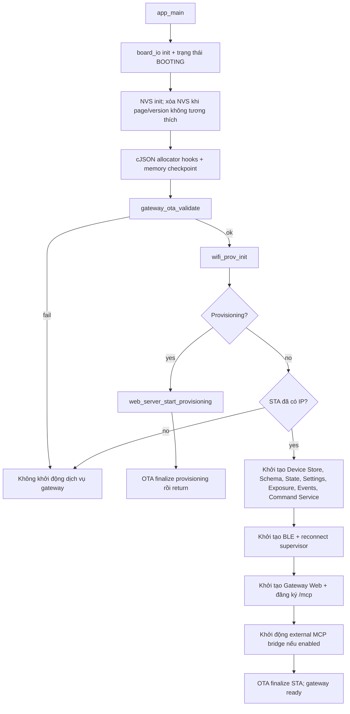
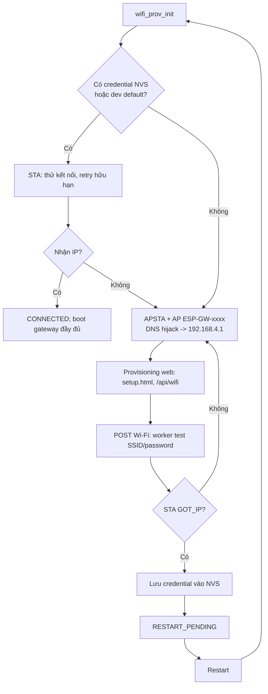
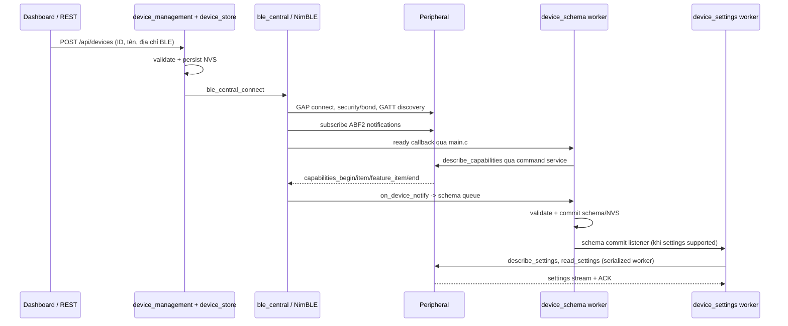
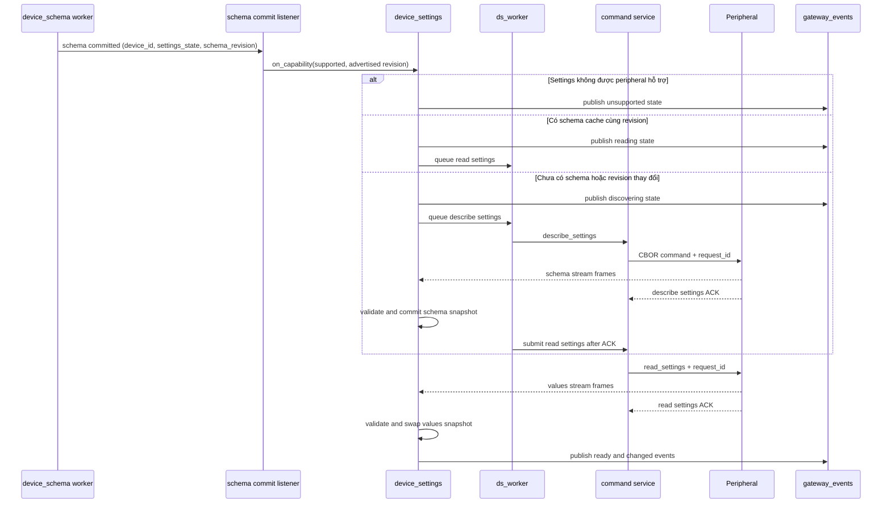
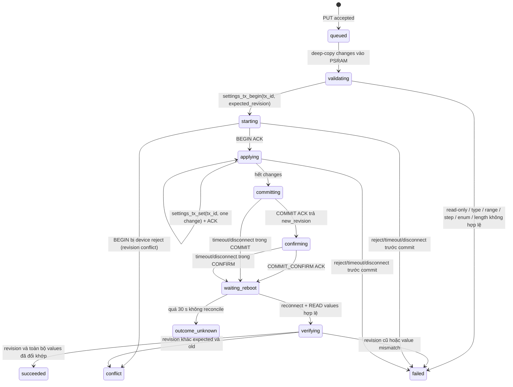
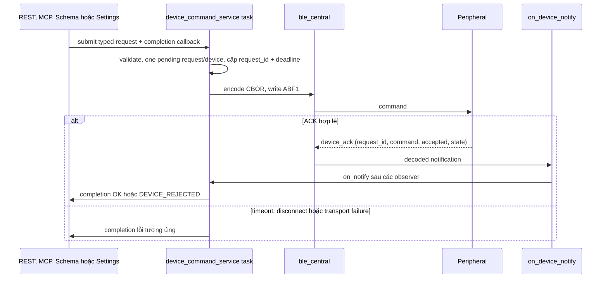
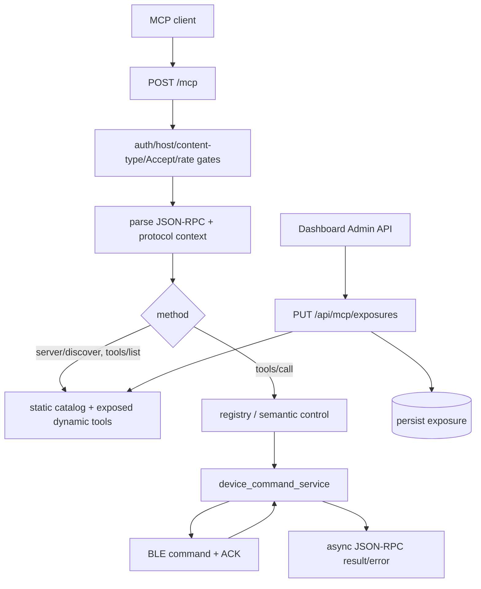

# Báo cáo kiến trúc và luồng hoạt động ESP32 BLE Gateway

**Ngày khảo sát:** 2026-09-08  
**Phạm vi:** firmware tại repository này, theo mã nguồn hiện tại. Tài liệu mô tả kiến trúc runtime, không phải bằng chứng HIL/runtime trên bo mạch.

## 1. Gateway làm gì

ESP32-S3 này là một **BLE Central** và điểm vào LAN. Nó lưu danh mục thiết bị BLE trong NVS, kết nối và subscribe notification của peripheral Protocol v4, rồi đưa các năng lực/trạng thái đó ra ba bề mặt:

- Dashboard nhúng trong firmware qua REST và `/ws/events`.
- `POST /mcp`, JSON-RPC/MCP cho client trong LAN.
- WebSocket bridge tùy chọn tới một MCP broker bên ngoài.

BLE dùng service `0xABF0`, characteristic ghi command `0xABF1` và notification `0xABF2`. Payload trên BLE là CBOR/QCBOR với key số; protocol gateway hiện là v4. Wi-Fi là điều kiện khởi động các dịch vụ gateway đầy đủ, không phải chỉ là một transport phụ.

## 2. Sơ đồ tổng thể

```mermaid
flowchart LR
    User[Browser / MCP client] -->|HTTP REST, WebSocket, JSON-RPC| Web[web_server]
    Broker[External MCP broker] <-->|MCP over WebSocket, optional| Bridge[mcp_ws_bridge]
    Bridge --> MCP[mcp_endpoint + tool exposure]
    Web --> Mgmt[device_management]
    Web --> DCS[device_command_service]
    MCP --> DCS
    Web --> Settings[device_settings]
    Mgmt --> Store[(NVS: device_store)]
    Schema[device_schema] <--> Store
    Exposure[mcp_tool_exposure] <--> Store
    Exposure --> MCP
    Settings <--> Store
    Schema --> DCS
    Settings --> DCS
    DCS --> BLE[ble_central / NimBLE]
    BLE <-->|CBOR Protocol v4\nABF0 / ABF1 / ABF2| Peripheral[BLE peripheral]
    BLE --> Notify[on_device_notify in main]
    Notify --> Schema
    Notify --> Settings
    Notify --> State[device_state]
    Notify --> DCS
    Schema --> Events[gateway_events]
    Settings --> Events
    State --> Events
    Mgmt --> Events
    BLE --> Events
    Events --> WS[/ws/events]
    WS --> User
```

`main/main.c` là composition root: nó nối callback notify BLE, lifecycle ready/disconnect, submitter của schema và listener schema→settings. Các component không gọi ngược trực tiếp vào HTTP UI.

## 3. Boot flow và hai chế độ Wi-Fi

### 3.1 Trình tự boot



Vì nhánh provisioning `return` trước phần `device_store_init()` và `ble_central_init()`, route provisioning không được phép giả định Device Store, BLE, command service hay MCP tồn tại. Chuyển provisioning→gateway là qua restart, không hot-switch HTTP mode trong cùng boot.

### 3.2 Quyết định Wi-Fi và provisioning



Quy tắc quan trọng: credentials chỉ được ghi sau `IP_EVENT_STA_GOT_IP`; disconnect trong runtime chỉ thử reconnect theo giới hạn, không tự mở captive portal. Board I/O nhận observer state Wi-Fi để đổi LED/display giữa booting, connecting, provisioning, ready và error. Nút factory reset chỉ xóa credential rồi restart.

## 4. BLE device lifecycle



`ble_central` quản lý GAP/GATT, pairing/bonding, scan, kết nối, subscribe và reconnect supervisor. Khi link đủ sẵn sàng, callback `on_device_ready()` trong `main.c` phát `device.connection=true` và enqueue schema discovery. Khi disconnect, callback phát `device.connection=false`, hủy/reconcile schema/settings, quên state cache và hoàn tất request command đang chờ với trạng thái not-connected.

## 5. Schema, feature state và Device Settings

### 5.1 Schema và feature state

Schema worker có queue riêng; callback NimBLE chỉ copy notification hợp lệ vào queue, còn decode/commit diễn ra ngoài host callback. Discovery stream gồm `capabilities_begin`, `capability_item`, `feature_item`, `capabilities_end`. Kết quả hợp lệ được persist trong NVS và phát `device.schema` event.

Sau mỗi schema commit (kể cả cache hit sau reboot), có ba consumers chính:

1. Settings listener kiểm tra `settings_state` và enqueue đồng bộ schema/giá trị settings khi peripheral hỗ trợ.
2. `device_state` best-effort seed các feature state bằng command đọc trạng thái.
3. `mcp_tool_exposure` có dữ liệu capability để reconcile dynamic tools đã persist.

Notification state thông thường được `device_state_on_notify()` hoặc ACK structured cập nhật cache `(device_id, feature_id, property_id)`, rồi phát `feature.state`. REST là snapshot/recovery authority; WebSocket chỉ truyền delta realtime.

### 5.2 Tổng quan Device Settings v2

```mermaid
flowchart LR
    SC[Schema commit: settings supported] --> Q[device_settings operation queue]
    Q --> W[ds_worker: serialize per operation]
    W --> DCS[device_command_service]
    DCS --> P[Peripheral CBOR]
    P -->|settings schema/value stream + ACK| N[on_device_notify]
    N --> DSP[device_settings_on_notify]
    DSP --> C[validate + atomic swap snapshot PSRAM]
    C --> E[gateway_events\nsettings.state / settings.changed / settings.transaction]
    E --> UI[Dashboard /ws/events]
    UI -->|PUT /api/devices/settings| TX[transaction BEGIN → SET* → COMMIT → CONFIRM]
    TX --> Q
```



Các API Settings là `GET/PUT /api/devices/settings`, `GET /api/devices/settings/operations`, và `GET /api/devices/settings/diagnostics`. Worker Settings và command service tách biệt: Settings quyết định operation/transaction protocol; command service sở hữu request ID, pending ACK, timeout và completion transport.

Snapshot Settings **không được persist xuống NVS trong implementation hiện tại**. Schema và values là snapshot immutable trong PSRAM, có refcount để REST reader có thể giữ snapshot cũ trong khi snapshot mới được atomically swap. Vì vậy reconnect/rediscovery là nguồn làm tươi dữ liệu Settings sau reboot gateway.

### 5.3 Điều kiện kích hoạt và read flow chi tiết

Luồng không khởi đầu từ REST. Nó bắt đầu khi Schema capability của peripheral vừa commit hoặc được nạp lại từ cache sau reconnect. Listener `on_schema_commit_for_settings()` trong `main.c` lấy `settings_state` và `settings_schema_revision` từ `device_schema`, rồi gọi `device_settings_on_capability()`.



Quyết định capability có ba nhánh:

| Điều kiện | Hành động | State/event |
|---|---|---|
| `settings_state` không phải `READY` | Không chạy discovery Settings | `settings.state: unsupported` |
| Có Settings và schema revision khác snapshot đang giữ, hoặc chưa có snapshot | `DESCRIBE_SETTINGS`, sau ACK mới `READ_SETTINGS` | `discovering` → `reading` |
| Có Settings và schema revision trùng snapshot | Bỏ qua describe, gửi thẳng `READ_SETTINGS` | `reading` |

`ds_worker` global serialize stream Settings: tại một thời điểm chỉ có một operation active, dù có tối đa 16 device record/operation slot. Điều này bảo vệ các builder global `s_schema_builder` và `s_values_builder`, vốn có một owner device/request duy nhất. Nếu command service đang bận hoặc peripheral trả `BUSY`, worker retry bounded với backoff **100 ms → 250 ms → 500 ms**; timeout, reject hoặc disconnect kết thúc operation lỗi.

Một READ chỉ hoàn thành khi **cả hai** điều kiện xảy ra: ACK `read_settings` đã nhận và `settings_values_end` hợp lệ đã commit snapshot values. ACK riêng lẻ chỉ nói rằng peripheral nhận command, không chứng minh gateway đã có snapshot mới.

### 5.4 Kiểm tra và commit stream nhận từ BLE

| Stream | Frames theo thứ tự | Các điều kiện commit chính | Kết quả |
|---|---|---|---|
| Schema | `settings_begin` → `settings_item`* → `settings_option_item`* → `settings_end` | protocol v4, `request_id` khớp owner, sequence liên tục, total khớp, descriptor/type/range hợp lệ, enum option count khớp | schema snapshot PSRAM, `schema_state=READY` |
| Values | `settings_values_begin` → `settings_values_value`* → `settings_values_end` | schema đã READY, request ID/owner/sequence/total khớp, ID có trong schema, type/range/enum/string hợp lệ, config revision khớp | values snapshot PSRAM và `config_rev` mới |

Nếu frame sai owner, sai `request_id`, duplicate/gap sequence, total/revision mismatch, setting không nằm trong schema, type/range/enum không hợp lệ, hoặc thiếu memory, stream bị reject: staging builder bị discard, state thành `error`, counter diagnostics tăng, và worker nhận completion fail cho values stream. Snapshot đã commit trước đó được giữ nguyên; gateway không xuất bản dữ liệu staging một phần.

Settings secret có xử lý riêng: frame hợp lệ vẫn có thể xác nhận setting tồn tại/configured, nhưng plaintext không được giữ trong snapshot REST/UI và log chỉ redacted. `GET /api/devices/settings` trả `{ "type": "secret", "configured": ... }` thay vì value.

### 5.5 Write transaction: `PUT /api/devices/settings`

REST PUT nhận `device_id`, `expected_revision`, và `changes[]`. Handler kiểm tra device tồn tại, Settings schema READY, số change (1–16), setting ID/type; sau đó gọi `device_settings_save()` và trả ngay **`202 Accepted`** với `operation_id` (transaction ID). Kết quả cuối không nằm trong response PUT; UI theo dõi WebSocket hoặc `GET /api/devices/settings/operations?device_id=...`.



Prevalidation trước `BEGIN` đảm bảo mỗi change là writable, đúng type, INT nằm trong `min/max/step`, ENUM thuộc option set, STRING không vượt `max_length`/wire limit. FLOAT hiện bị từ chối ở write path vì chưa có G7 wire value. Một device chỉ có một transaction active; change được deep-copy vào PSRAM để request HTTP có thể được giải phóng an toàn.

Sau `COMMIT` ACK, gateway gửi `COMMIT_CONFIRM` với revision mới. Thành công transport tại đây chưa phải terminal success: transaction vào `waiting_reboot`, gateway chờ device reconnect rồi read Settings lại. Reconciliation so sánh:

| Sau reconnect/read | Kết quả terminal |
|---|---|
| `config_rev == expected new revision` và tất cả changes khớp | `succeeded` |
| `config_rev == old revision` | `failed` — commit không persist |
| revision khác cả old và expected | `conflict` — có thay đổi ngoài transaction |
| Không reconnect/không có snapshot hợp lệ trong 30 giây | `outcome_unknown` |

Timeout hoặc disconnect **trước** COMMIT là lỗi rõ ràng. Trong COMMIT/CONFIRM, persistence trên device có thể đã xảy ra dù gateway không thấy ACK, nên flow chuyển sang `waiting_reboot` để reconcile thay vì tuyên bố failed ngay.

### 5.6 Mapping realtime, REST và xử lý disconnect

| Nguồn | Event `/ws/events` | Ý nghĩa cho UI |
|---|---|---|
| Capability/stream bắt đầu hoặc lỗi | `settings.state` (`discovering`, `reading`, `ready`, `unsupported`, `error`) | đổi trạng thái tải/khả dụng của form |
| Values snapshot mới | `settings.changed` kèm `configRevision` | GET lại `/api/devices/settings` để lấy snapshot authoritative |
| Transaction | `settings.transaction` kèm `operationId`, `state`, progress, expected/new revision | hiển thị tiến độ queued → validating → starting → applying → committing → confirming → waiting_reboot → verifying → terminal |

Khi BLE disconnect, module giải phóng builder/staging và worker hủy/invalidate pending operation, nhưng **giữ snapshot schema/values đã commit** để UI vẫn có dữ liệu cuối cùng (có thể stale). Lần `on_capability()` sau reconnect quyết định rediscover hay read lại dựa vào advertised schema revision; nếu transaction đang `waiting_reboot`, values stream commit sẽ kích hoạt reconciliation trước khi phát `settings.changed` cho browser.

Để chẩn đoán, `GET /api/devices/settings/diagnostics` trả counters discovery, reject/transaction/reconcile và heap internal/PSRAM. Không suy kết data Settings hiện tại chỉ từ event: event là invalidation/delta, REST GET là snapshot authority.

## 6. Luồng command chung



Nguồn command gồm `/api/command`, MCP static/dynamic tool, schema discovery, feature-state seeding và Settings. HTTP/MCP handler giữ request theo API async rồi response khi completion về; vì vậy HTTP server không chặn trong lúc chờ ACK. Command service là ACK owner duy nhất; `main.c` vẫn để schema/settings/state quan sát notification trước khi chuyển ACK tới service.

## 7. Web UI, REST và realtime events

Gateway web server nhúng assets gzip, không serve file từ filesystem. Source dashboard ở `components/web_server/www_src/`, được assemble thành `www/dashboard.html` trước khi firmware embed.

| Bề mặt | Vai trò chính |
|---|---|
| Provisioning web | `/`, `/api/status`, `/api/wifi`, `/api/wifi/scan`; chỉ ở provisioning mode |
| Gateway REST | device CRUD, BLE scan, command, schema/detail/settings, system, MCP exposure/settings |
| `/ws/events` | Delta: lifecycle device, schema, feature state, settings state/change/transaction và yêu cầu resync |
| Dashboard JS | initial snapshot bằng REST, nhận delta qua WebSocket, REST lại khi cần recovery/resync |

`gateway_events` là bus đồng bộ, fixed-size và không cấp phát heap. Nó gán sequence monotonic trước khi gọi listener. `web_event_ws` serialize event thành JSON và gửi async tới các WebSocket client; một disconnect/reset của client không được coi là lỗi BLE hoặc lỗi command.

## 8. MCP và dynamic tool exposure



MCP endpoint được đăng ký chỉ sau khi gateway web server chạy. Nó giới hạn body, áp dụng gate auth/host/header/rate limit, rồi dispatch JSON-RPC. `tools/list` hợp nhất static tools với dynamic tools được expose từ capability; `tools/call` có thể kết thúc bất đồng bộ sau BLE ACK. Exposure được persist và reconcile khi boot/schema commit; persist đơn lẻ không đủ nếu RAM catalog chưa được publish.

`mcp_ws_bridge` là một client độc lập, optional. Sau khi STA gateway đã sẵn sàng, `main.c` load config NVS; nếu `enabled`, bridge init/start và kết nối MCP broker qua WebSocket. Retry bridge không đồng nghĩa firmware chạy `app_main` lần hai.

## 9. Lưu trữ, concurrency và điểm cần nhớ

| Dữ liệu / trách nhiệm | Owner chính | Cơ chế |
|---|---|---|
| Wi-Fi credential | `wifi_provisioning` | NVS `wifi_cfg`; chỉ persist sau nhận IP |
| Device inventory, BLE identity | `device_store` | NVS, snapshot an toàn task |
| Capability schema | `device_schema` | runtime record + NVS; schema worker queue |
| Settings schema/values/transaction | `device_settings` | operation worker và cache/persistence |
| Feature state runtime | `device_state` | cache RAM, tái seed từ schema sau boot |
| Pending BLE request | `device_command_service` | queue/task, request ID, deadline, tối đa một pending/device |
| UI realtime | `gateway_events` | fixed-size event + sequence → WebSocket |
| MCP exposure/config bridge | `mcp_tool_exposure`, `mcp_ws_bridge` | NVS + RAM catalog/config |

- Không gọi logic nặng, HTTP hay BLE write trong callback NimBLE; chuyển sang worker/queue khi cần.
- Không log bên trong `portENTER_CRITICAL()`.
- Một API REST thành công thường chỉ chứng minh acceptance ở gateway; trạng thái thiết bị cuối cùng cần ACK BLE hoặc event/state mới.
- Quy định timeout HTTP receive (5 giây) liên quan ACK timeout command; không giảm độc lập.
- Firmware unit test ở `test/` là project ESP-IDF riêng và flash vào hardware; không xem như host test.

## 10. Bản đồ mã nguồn để tiếp tục khảo sát

| Mục đích | Entry point đáng đọc |
|---|---|
| Composition/boot/callback wiring | `main/main.c` |
| Wi-Fi, captive portal, retry | `components/wifi_provisioning/wifi_prov.c` |
| BLE Central | `components/ble_central/` |
| CBOR Protocol v4 | `components/cbor_codec/cbor_codec.c` |
| Command queue/ACK | `components/device_command_service/` |
| Schema discovery/persistence | `components/device_schema/` |
| Settings read/write transaction | `components/device_settings/` |
| State/event bus | `components/device_state/`, `components/gateway_events/` |
| REST/WebSocket/dashboard assets | `components/web_server/` |
| JSON-RPC/MCP, exposure and broker bridge | `components/mcp_endpoint/`, `components/mcp_tool_exposure/`, `components/mcp_ws_bridge/` |

## 11. Ranh giới xác minh của báo cáo

Các flow trên được suy ra từ source hiện tại và route/initialization wiring; tài liệu không khẳng định board đang kết nối, Wi-Fi/BLE peripheral đang hoạt động, hay browser visual QA đã pass. Những điều đó cần build/flash và HIL test riêng.
